# Playnite Extensions

Free, open-source **Playnite** add-ons: small plugins that tidy up the desktop library and **desktop themes**. Each add-on is built and published on its own; pick the ones you want.

I'm a product designer, and these are what I make when I'm not doing that. They're free and will stay free. If they make your library nicer, the best support is a suggestion or bug report on the [issues page](https://github.com/danitesler/playnite-extensions/issues). If you like my work and want to see more, take a look at my [portfolio](https://danitesler.com), or [buy me a coffee on Ko-fi](https://ko-fi.com/danitesler) if you'd like to chip in. Thank you 🙂

## Add-ons

Each add-on has its own **GitHub Release** and installer (`.pext` for extensions, `.pthm` for themes). Browse **[Releases](https://github.com/danitesler/playnite-extensions/releases)**, open the release for the add-on you want, and download the attached file. You can also find and install them from **Add-ons** inside Playnite.

### Plugins

| Icon | Plugin |
| --- | --- |
|  | [**Autogrid**](https://github.com/danitesler/playnite-extensions/releases/tag/autogrid-v1.1.1) Keeps your grid at the column count you want while you resize Playnite, scaling covers so the gutters stay even. |
|  | [**GameHoverDetails**](https://github.com/danitesler/playnite-extensions/releases/tag/gamehoverdetails-v1.1.2) Hover a game in the library and a small card appears beside it with the details you care about, like play time or developer. |
|  | [**AutoStatus**](https://github.com/danitesler/playnite-extensions/releases/tag/autostatus-v1.0.0) Keeps completion status honest: games you stop playing drift to On Hold, and a game you launch goes back to Playing. |
|  | [**RandomTheme**](https://github.com/danitesler/playnite-extensions/releases/tag/randomtheme-v0.1.0) Starts Playnite in a different installed theme each time, with separate picks for Desktop and Fullscreen. |

### Themes

| Preview | Theme |
| :---: | :--- |
| <a href="src/themes/ShadcnUi/art/details.png">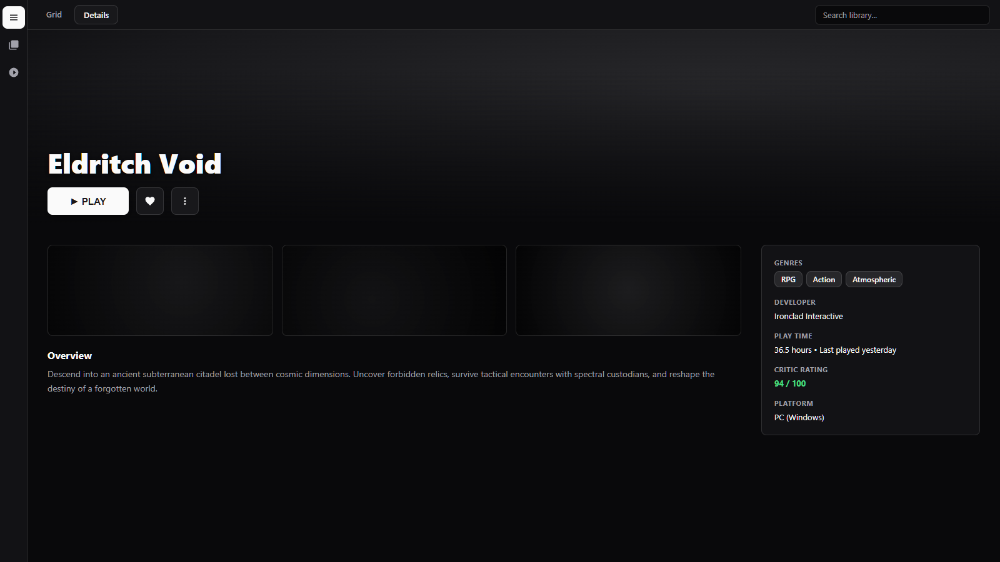</a> | [**Shadcn UI**](https://github.com/danitesler/playnite-extensions/releases/tag/shadcnui-v0.1.0) A dark theme that feels like shadcn/ui: a rounded library card on a zinc frame, quiet controls and Lucide icons. Design system: [shadcn/ui](https://ui.shadcn.com). |
| <a href="src/themes/ChakraUi/art/details.png">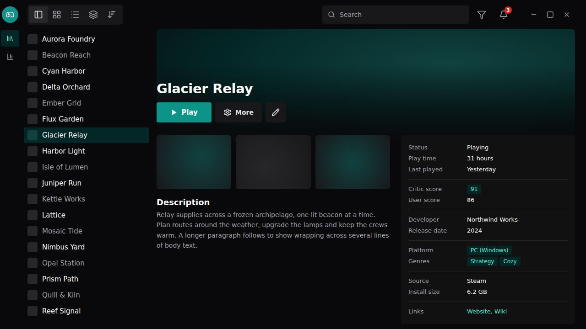</a> | [**Chakra UI**](https://github.com/danitesler/playnite-extensions/releases/tag/chakraui-v0.1.0) A dark theme on one flat surface, with a teal accent, segmented view controls and roomy spacing. Design system: [Chakra UI](https://chakra-ui.com). |
| <a href="src/themes/MaterialUi/art/details.png">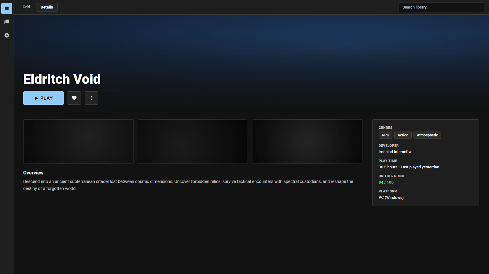</a> | [**Material UI**](https://github.com/danitesler/playnite-extensions/releases/tag/materialui-v0.1.0) A dark theme that follows Material's defaults, with an elevated app bar, a mini drawer and filled inputs. Design system: [Material UI](https://mui.com). |
| <a href="src/themes/Primer/art/details.png">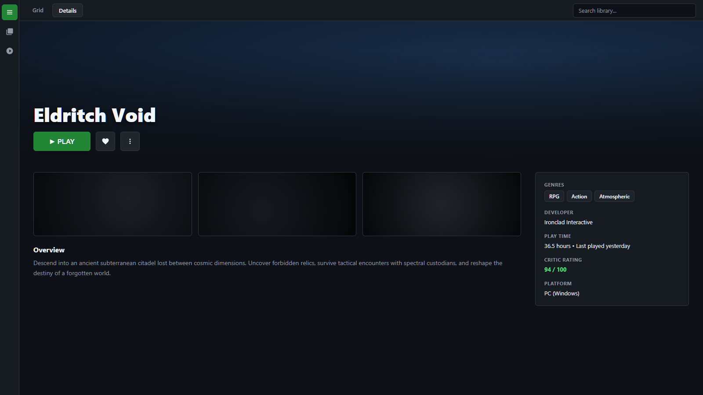</a> | [**Primer**](https://github.com/danitesler/playnite-extensions/releases/tag/primer-v0.1.0) A dark theme that borrows GitHub's look, with a header band, a navigation rail, Octicons and green primary buttons. Design system: [GitHub Primer](https://primer.style). |
| <a href="src/themes/Fluent2/art/details.png">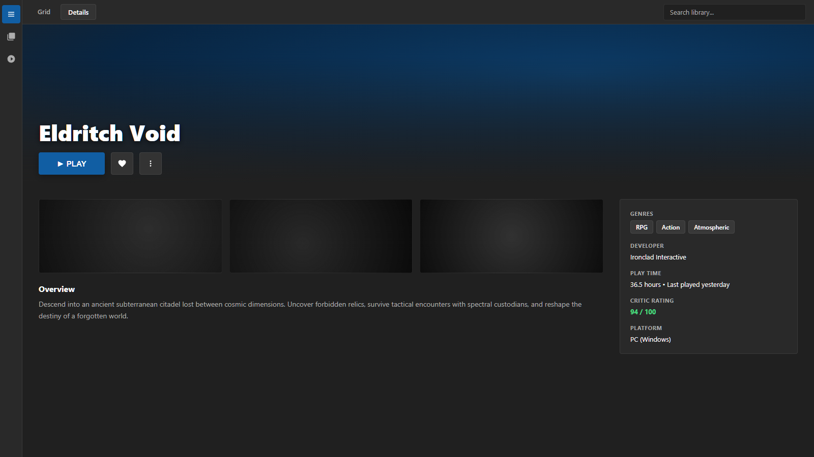</a> | [**Fluent 2**](https://github.com/danitesler/playnite-extensions/releases/tag/fluent2-v0.1.0) A dark theme that feels like Windows 11, with a navigation rail, centered search and Fluent icons. Design system: [Microsoft Fluent 2](https://fluent2.microsoft.design). |
| <a href="src/themes/Launchpad/art/details.png">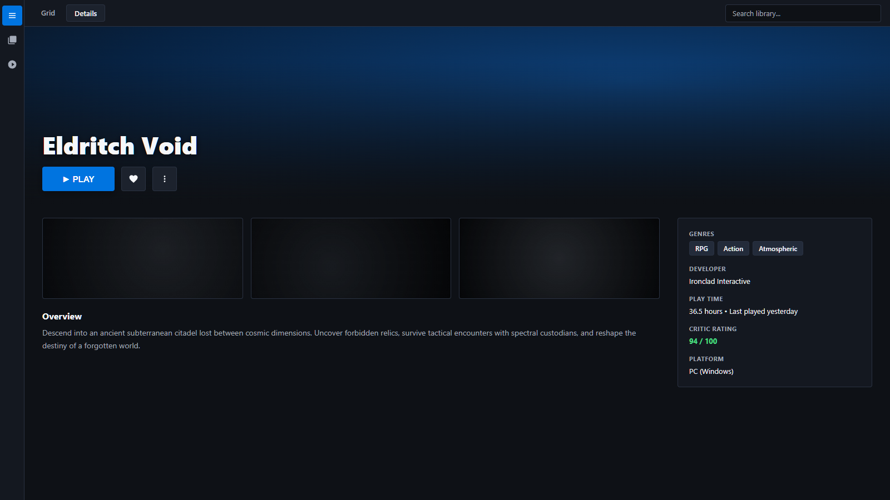</a> | [**Launchpad**](https://github.com/danitesler/playnite-extensions/releases/tag/launchpad-v0.1.0) A dark game-launcher look after the Battle.net app: an icon rail, a game list beside a full-width art page, and a big blue Play button. |
| <a href="src/themes/Codex/art/details.png">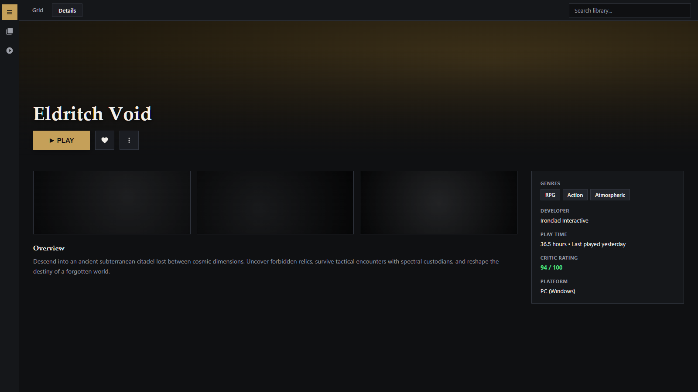</a> | [**Codex**](https://github.com/danitesler/playnite-extensions/releases/tag/codex-v0.1.0) Charcoal, ivory and gold, after the Assassin's Creed menus, with a left rail and game screens laid out like codex entries. |
| <a href="src/themes/Questlog/art/details.png">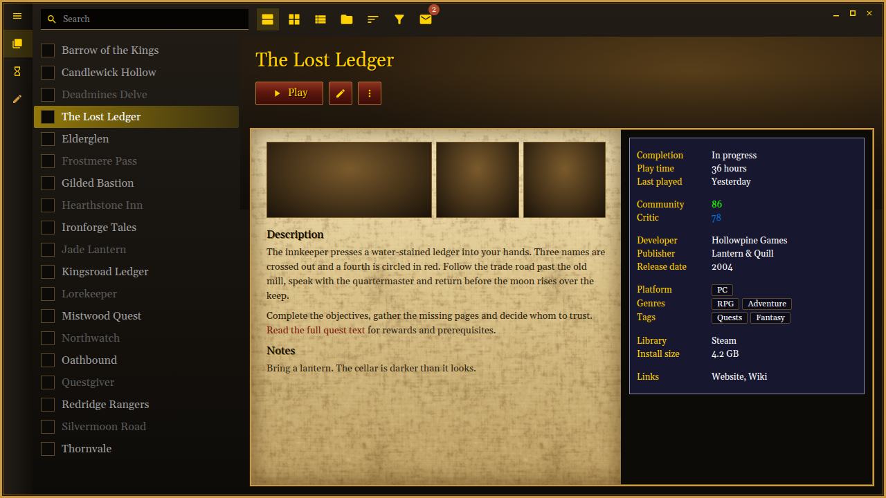</a> | [**Questlog**](https://github.com/danitesler/playnite-extensions/releases/tag/questlog-v0.1.0) A dark fantasy theme after the World of Warcraft Vanilla interface, with gold frames, red leather buttons and a quest-log game page. |
|  | **Uplink** A sci-fi theme after the StarCraft II menus, with a lit navigation rail, cut-corner plates and blue glows. |
| <a href="src/themes/Ancient/art/details.png">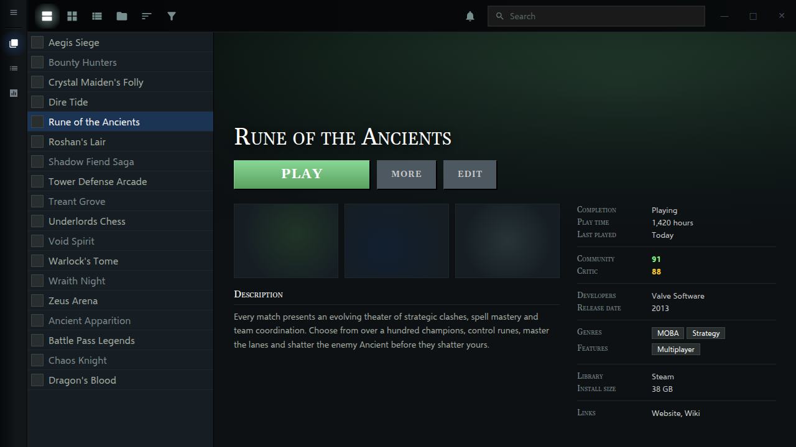</a> | **Ancient** After the Dota 2 main menu: a slate rail with a blue glow, a black top strip and a green Play button. |
| <a href="src/themes/Clutch/art/details.png">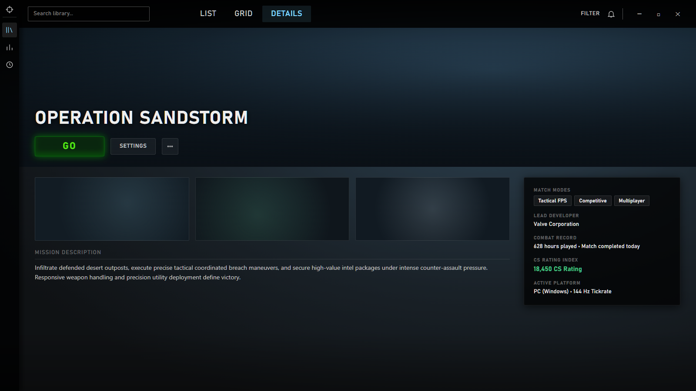</a> | **Clutch** After the Counter-Strike 2 main menu: translucent black panels, uppercase view tabs and a green GO button. |
| <a href="src/themes/Libertalia/art/details.png">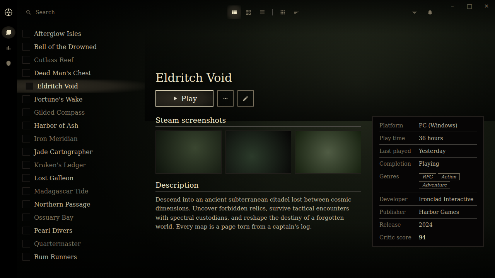</a> | **Libertalia** After the Uncharted 4 menus: ivory on black, a soft highlight behind the selected item, framed panels. |
| <a href="src/themes/Ayywi/art/details.png">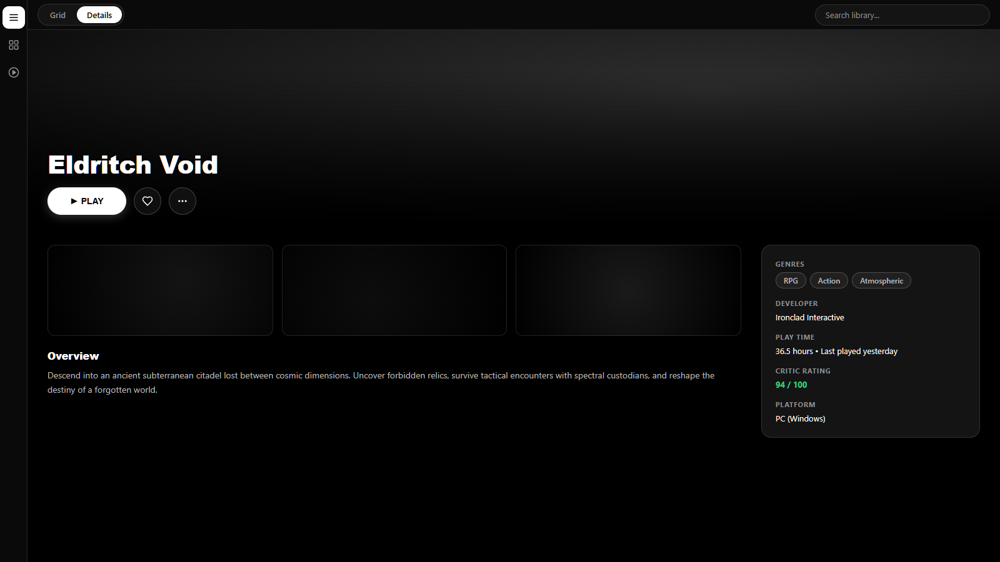</a> | **Ayywi** A monochrome dark theme with black surfaces, hairline borders and pill buttons. Design system: [ayywi](https://github.com/danitesler/ayywi). |
| <a href="src/themes/Biome/art/details.png">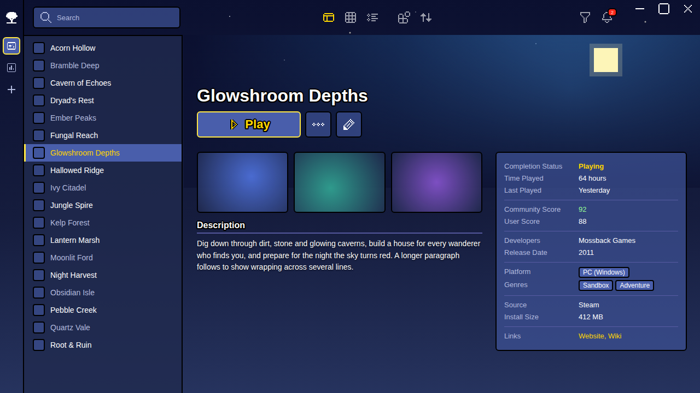</a> | **Biome** After the Terraria main menu: blue menu panels over a night sky, outlined menu words that turn gold and pixel-art icons. |
| <a href="src/themes/Dropzone/art/details.png">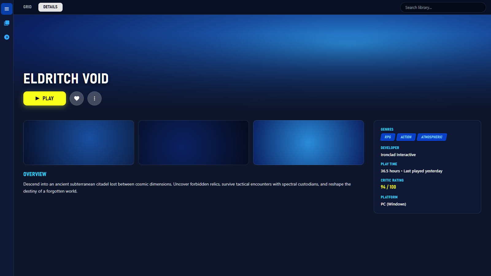</a> | **Dropzone** Deep navy and PLAY yellow, after the Fortnite lobby: a rounded navbar strip with a light pill for the current view, a slanted rail tab and rounded Discover-style covers. |
| <a href="src/themes/Attache/art/details.png">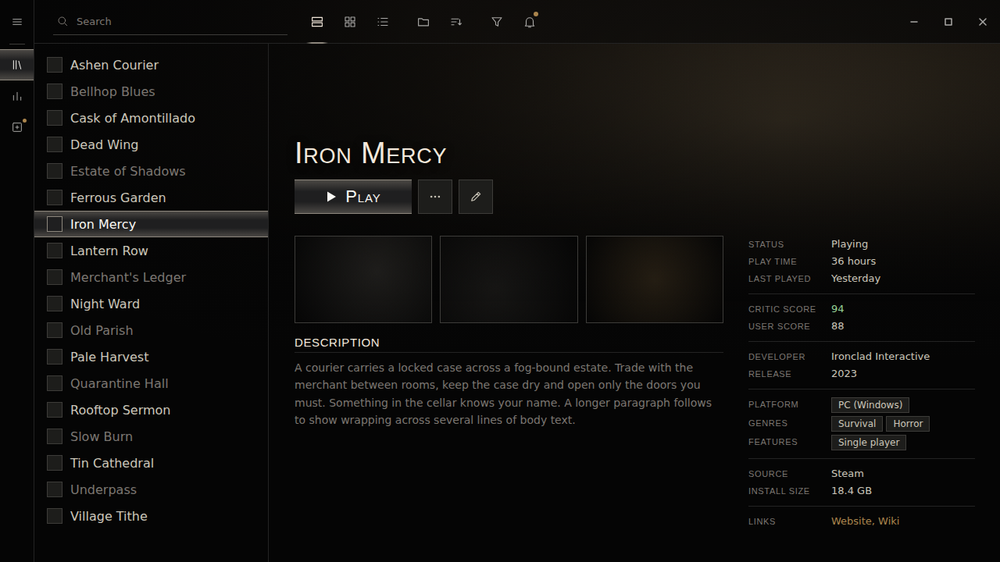</a> | **Attache** After the Resident Evil 4 (2023) menus: a main menu of words on near black, a brushed pewter selection plate and warm grey type. |
|  | **Medallion** Black and minimal, after The Witcher 3 main menu: a brush-edged icon rail, uppercase DIN text and thin double frames. |
| <a href="src/themes/Overworld/art/details.png">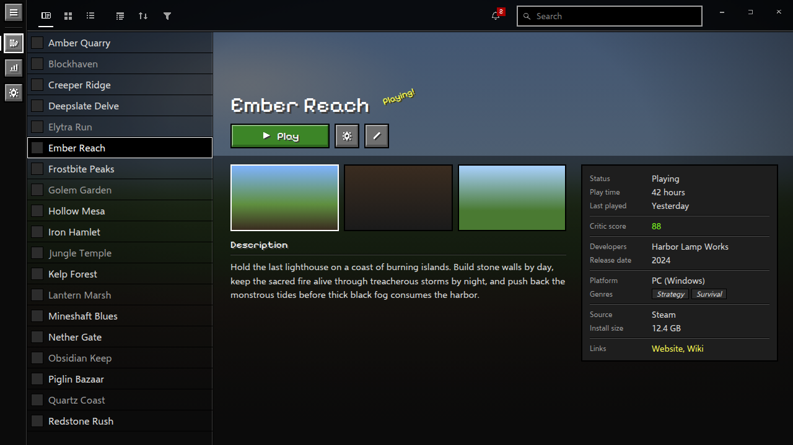</a> | **Overworld** After the Minecraft title screen: stone buttons, a dark tab strip over blurred game art, pixel icons and a green Play button. |
| <a href="src/themes/Tumbleweed/art/details.png">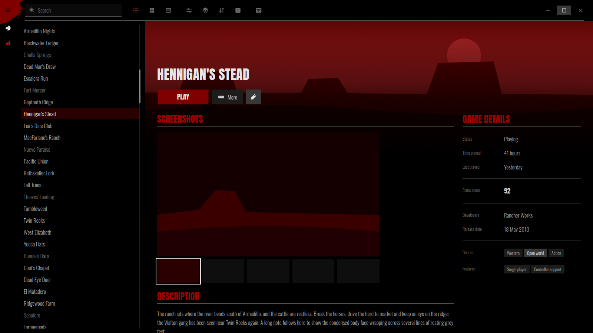</a> | **Tumbleweed** After the original Red Dead Redemption menus: maroon headings on pure black, grey text that turns white when selected, keycap buttons and red duotone art. |
| <a href="src/themes/Hearthside/art/details.png">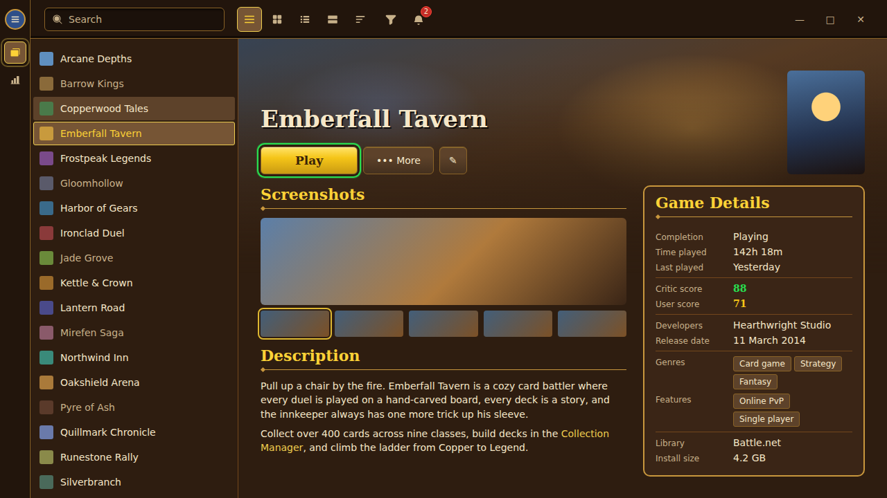</a> | **Hearthside** After the Hearthstone interface: dark tavern wood in brass frames, gold selection, parchment tooltips, mana-blue bars and an End Turn Play button. |
| <a href="src/themes/Payload/art/details.png">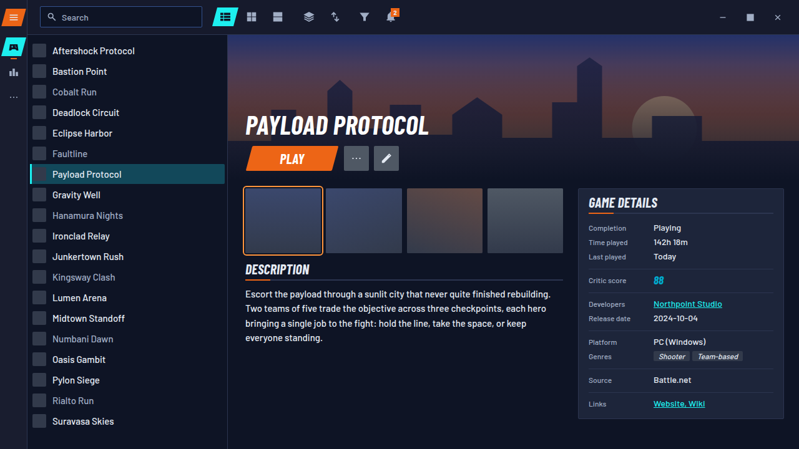</a> | **Payload** After the Overwatch 2 menus: navy panels from the career profile, cyan selection with black type, a slanted orange Play plate and scores in the team colors. |
| <a href="src/themes/FrozenThrone/art/details.png">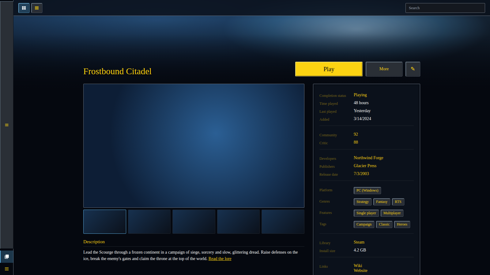</a> | **Frozen Throne** After the Warcraft III: The Frozen Throne main menu: near-black blue void, bevelled stone plates, gold labels that turn white on hover and ice-blue glow. |
| <a href="src/themes/Netrunner/art/details.png">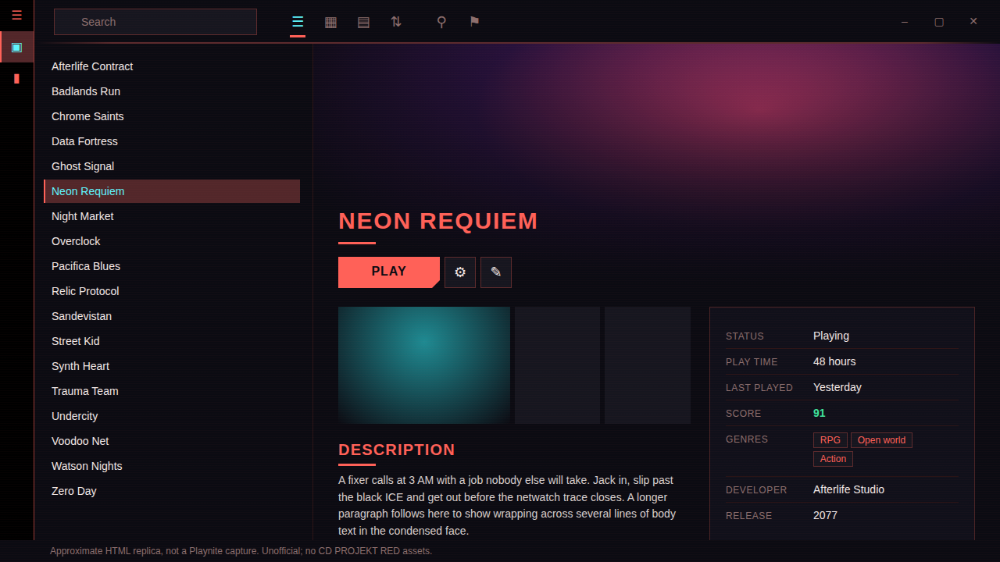</a> | **Netrunner** After the Cyberpunk 2077 menus: red menu ink on blue-black, a dark red selection wash, cyan focus and a cut-corner Play plate. |
| <a href="src/themes/NightCity/art/details.png">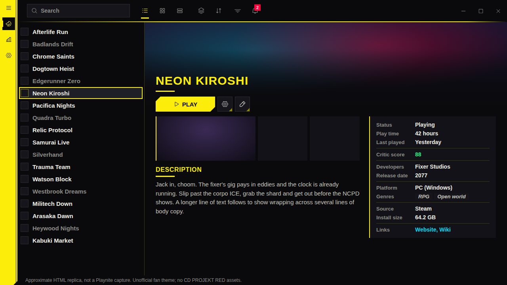</a> | **Night City** After the Cyberpunk 2077 interface: an acid-yellow rail, chamfered yellow Play slab, yellow selection frames and cyan focus on near black. |
| <a href="src/themes/NightCity2/art/details.png">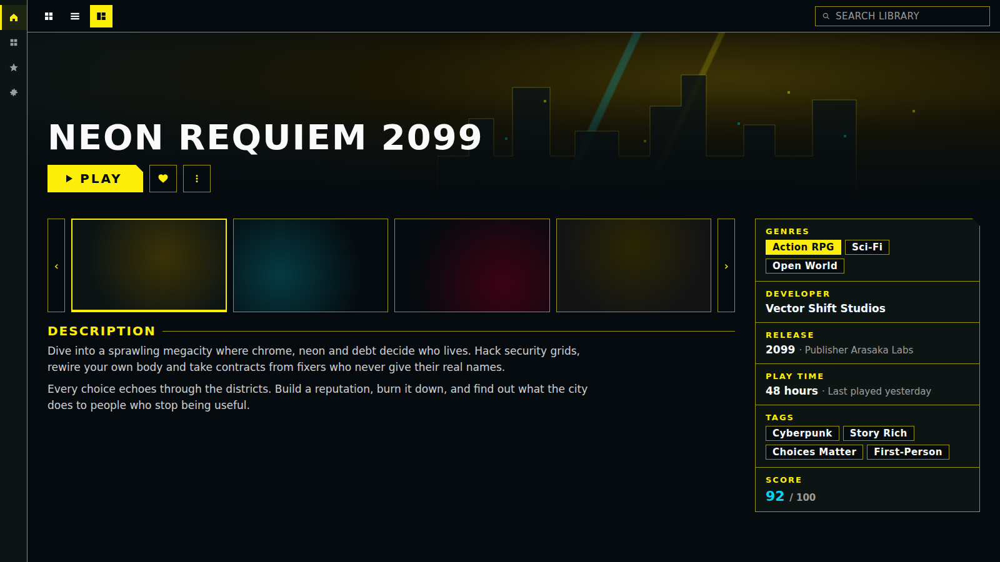</a> | **Night City 2** A second take on the Cyberpunk 2077 yellow menus: black panels, solid yellow selection with black text, cyan focus and cut corners. |

## Installation

1. **Inside Playnite:** open **Add-ons** from the main menu, browse or search for the extension, and install it from there.
2. **Or from GitHub:** on **[Releases](https://github.com/danitesler/playnite-extensions/releases)**, open the release for the add-on you want, download its `.pext` or `.pthm` file, and open it in **Windows** (double-click or choose **Open**).
3. Click **Install** when Playnite prompts you, then restart Playnite.

## Questions, suggestions, and issues

If you have a question, suggestion, or run into a problem, [open an issue](https://github.com/danitesler/playnite-extensions/issues).

---

Themes inspired by other products are unofficial fan work, not affiliated with or endorsed by their owners. All names and marks belong to them. No third-party logos, game files or proprietary artwork are included.
