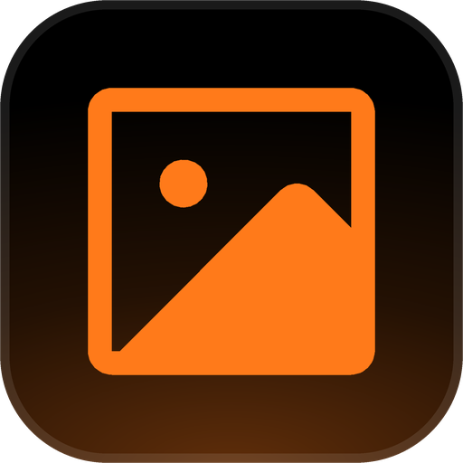
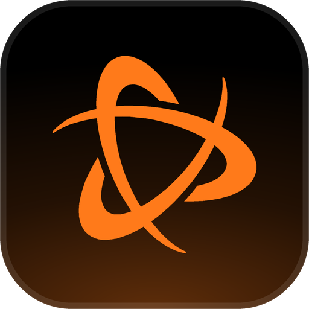
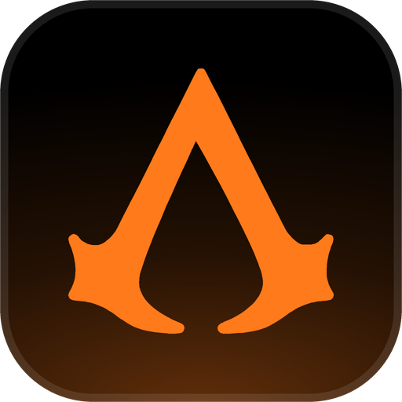
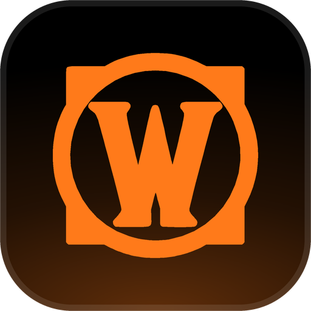

# Playnite Extensions

Open-source **Playnite** add-ons in one place: small plugins that tweak the desktop library—layout, information at a glance, tidy metadata, and other quality-of-life improvements—and **desktop themes**. Each add-on is built and published on its own; pick the ones you want.

## Support this work

These add-ons are **free** and stay that way. If they make your library nicer and you want to help me keep shipping updates, the best would be to leave a suggestion or feedback via issues page.

$$$ support is highly welcome too 🙂

**[Support this work on Ko-fi →](https://ko-fi.com/danitesler)**

## Add-ons

Each add-on has its own **GitHub Release** and installer (`.pext` for extensions, `.pthm` for themes). Browse **[Releases](https://github.com/danitesler/playnite-extensions/releases)**, open the release for the add-on you want, and download the attached file. You can also find and install them from **Add-ons** inside Playnite.

| Icon | Name | Description |
| --- | --- | --- |
|  | **Autogrid** (`autogrid`) | Keeps the Desktop grid at a target column or row count as you resize Playnite, scaling covers automatically to keep gutters even. |
|  | **GameHoverDetails** (`gamehoverdetails`) | A hover card beside library tiles showing the game details you pick, up to five fields like play time or developer, in your theme colors or over the game's background art. |
|  | **AutoStatus** (`autostatus`) | Keeps completion status in step with how you play: stale Playing games move to On Hold after a number of days you pick, and starting an On Hold, Abandoned, or Plan to Play game sets it back to Playing. |
|  | **ExeIcon** (`exeicon`) | A metadata source that fills missing game icons from the game's own executable, including Steam and Epic imports, keeping every size up to 256px with no internet needed. |

### Themes

| Icon | Name | Description |
| --- | --- | --- |
|  | **Shadcn UI** (`shadcnui`) | A fully dark desktop theme in shadcn/ui style, with the library on a rounded inset card in a zinc frame, borderless controls, and Lucide icons throughout. [Preview components](https://ui.shadcn.com/docs/components) |
|  | **Chakra UI** (`chakraui`) | A fully dark desktop theme in Chakra UI style, on one flat surface with a teal accent, segmented view controls, roomy top bar, and underline tabs. [Preview components](https://chakra-ui.com/docs/components/concepts/overview) |
|  | **Material UI** (`materialui`) | A fully dark desktop theme in Material UI style, with an elevated app bar, mini drawer, filled inputs, uppercase buttons, and Material icons. [Preview components](https://mui.com/material-ui/all-components/) |
|  | **Primer** (`primer`) | A fully dark desktop theme in GitHub Primer style, with a dark header band, navigation rail, Octicons, green primary buttons, and coral underline tabs. [Preview components](https://primer.style/components) |
|  | **Fluent 2** (`fluent2`) | A fully dark desktop theme in Microsoft Fluent 2 style, with a Windows 11 navigation rail, centered search, underline inputs, and Fluent icons. [Preview components](https://react.fluentui.dev/) |
|  | **Battle.net** (`battlenet`) | A fully dark desktop theme in the style of the Battle.net app, with a top app bar, a game list next to a game page with full-width art, and a big blue Play button. Colors are approximated; Blizzard's logos and icons are not included. |
|  | **Assassin's Creed** (`assassinscreed`) | A dark desktop theme modeled on the Assassin's Creed game menus, with a tab strip along the top, gold on charcoal, diamond and corner-bracket marks, hairline icons, and entry-style game info screens. Unofficial; not affiliated with Ubisoft. |
|  | **WoW Vanilla** (`wowvanilla`) | An unofficial, fan-made desktop theme in the style of the World of Warcraft Vanilla interface: gold and bronze frames, red leather buttons, the navy tooltip, and a game page laid out like the quest log. All artwork is original; no game files are included. |

## Installation

1. **Inside Playnite:** open **Add-ons** from the main menu, browse or search for the extension, and install it from there.
2. **Or from GitHub:** on **[Releases](https://github.com/danitesler/playnite-extensions/releases)**, open the release for the add-on you want, download its `.pext` or `.pthm` file, and open it in **Windows** (double-click or choose **Open**).
3. Click **Install** when Playnite prompts you, then restart Playnite.
4. After it’s installed, you’ll find it under **Add-ons → Extension settings → Generic** — pick the add-on there to turn it on and change its options. **ExeIcon** has no settings: choose it as the **Icon** source when you download metadata. For a theme, pick it under **Settings → Appearance → Theme** and restart Playnite.

## Questions, suggestions, and issues

If you have a question, suggestion, or run into a problem, [open an issue](https://github.com/danitesler/playnite-extensions/issues).
