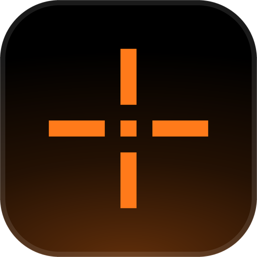
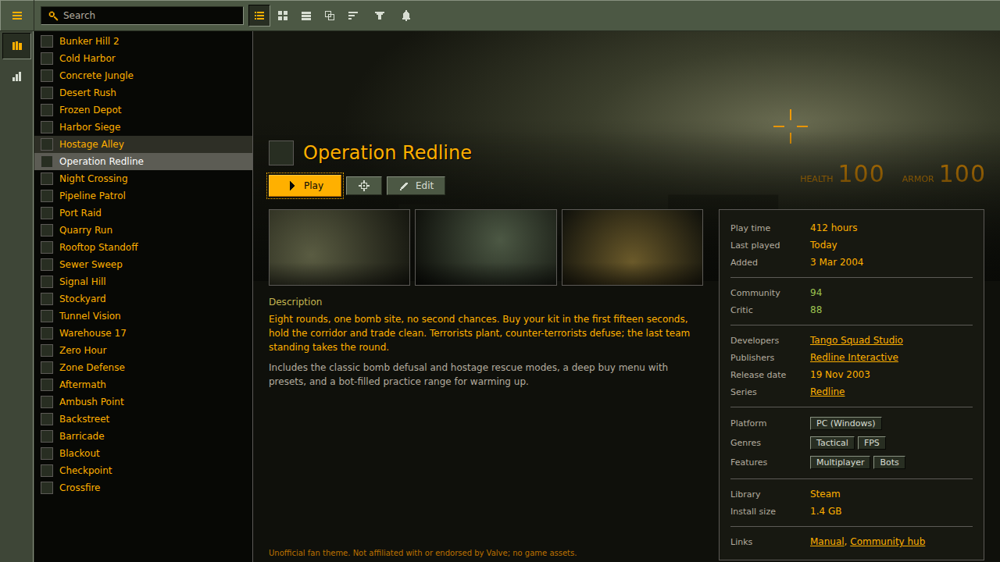
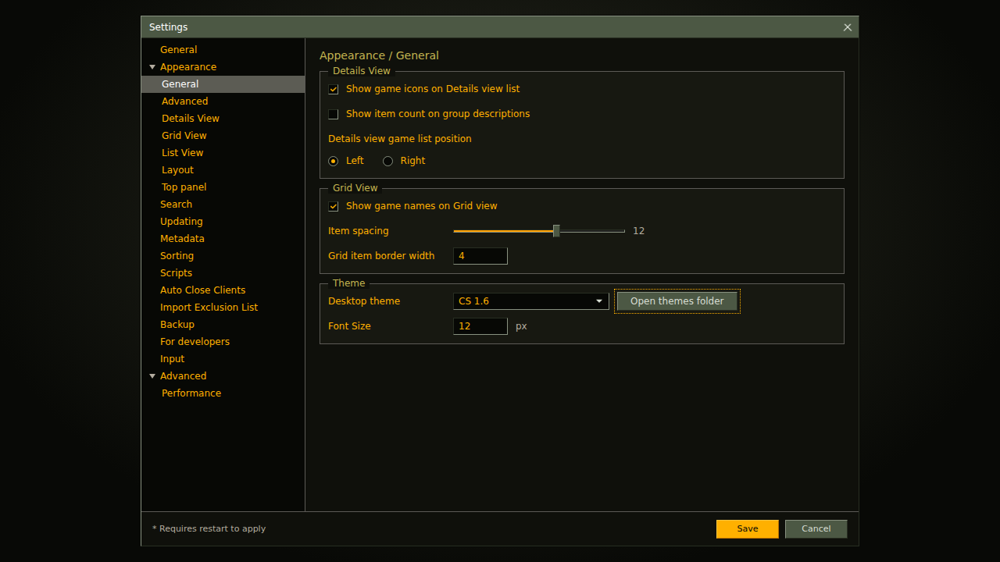

<!-- Generated by scripts/generate-readmes.mjs from info/*.yaml and git tags. Edit those, then re-run it; do not edit this file by hand. -->

# CS 1.6

**Olive Steam chrome around black panels with amber text, inspired by the Counter-Strike 1.6 menus: square corners, 1px bevels, dotted focus.**

_Not released yet._

## Screenshots

## About

Olive Steam / GoldSrc window frames and bevelled buttons around black panels with amber Verdana text, a pale selection bar like the buy menu, HUD-amber progress fills and a dotted focus rectangle, inspired by the Counter-Strike 1.6 menus. Square corners everywhere, original pixel icons. Unofficial fan theme: no Valve assets. Verdana ships with Windows.

## Install

1. **Inside Playnite:** open **Add-ons** from the main menu, browse or search for **CS 1.6**, and install it from there.
2. **Or from GitHub:** download the `.pthm` file from the release page (see Download above) and open it in **Windows** (double-click it or drag it onto Playnite).
3. Click **Install** when Playnite prompts you, then restart Playnite.
4. Pick the theme in **Settings → Appearance → General → Theme** (Desktop mode), then restart Playnite if it asks.

## Details

- **Type:** Theme (Desktop mode)
- **Latest release:** not released yet
- **Playnite theme API:** 2.9.0
- **Tags:** Dark, Desktop
- **Source:** [src/themes/Cs16](https://github.com/danitesler/playnite-extensions/tree/main/src/themes/Cs16)
- **Issues and suggestions:** [GitHub issues](https://github.com/danitesler/playnite-extensions/issues)

## Notices and licenses

- [LICENSE-Playnite.txt](info/LICENSE-Playnite.txt)
- [NOTICE-Cs16.txt](info/NOTICE-Cs16.txt)

---

[← All add-ons](../../../README.md)
