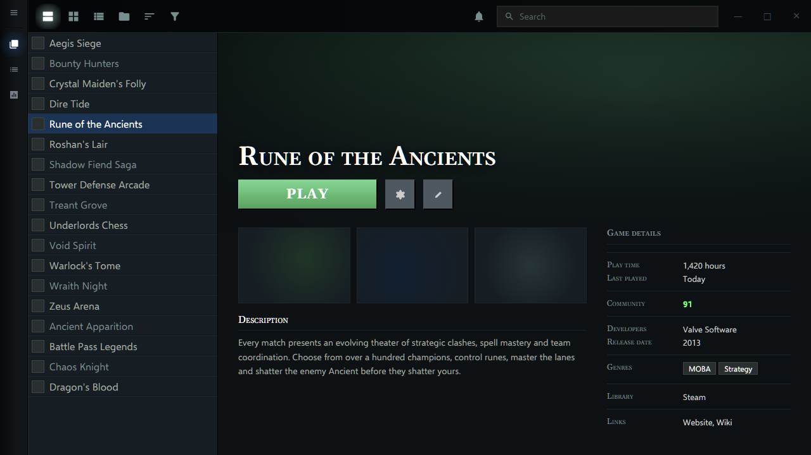
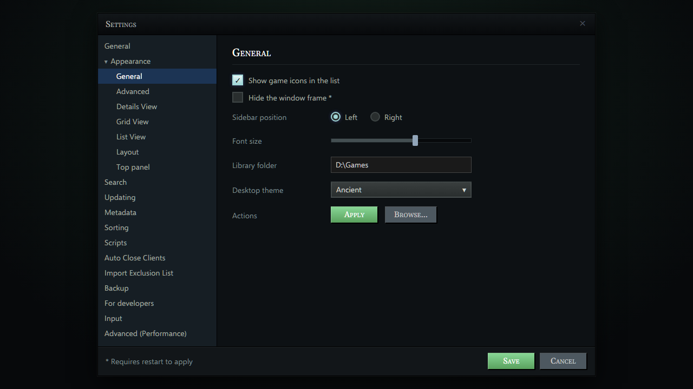

<!-- Generated by scripts/generate-readmes.mjs from info/*.yaml and git tags. Edit those, then re-run it; do not edit this file by hand. -->

# Ancient

**A dark desktop theme with a slate navigation rail, a black top strip, bevelled grey buttons and a big green Play button. Inspired by the Dota 2 main menu.**

_Not released yet._

## Screenshots

## About

A dark theme after the Dota 2 main menu: a slate navigation rail with a blue glow on the current item, a black top strip, bevelled grey buttons and a big green Play button.

Unofficial; not affiliated with Valve. Dota 2 is a trademark of Valve Corporation.

## Install

1. **Inside Playnite:** open **Add-ons** from the main menu, browse or search for **Ancient**, and install it from there.
2. **Or from GitHub:** download the `.pthm` file from the release page (see Download above) and open it in **Windows** (double-click it or drag it onto Playnite).
3. Click **Install** when Playnite prompts you, then restart Playnite.
4. Pick the theme in **Settings → Appearance → General → Theme** (Desktop mode), then restart Playnite if it asks.

## Details

- **Type:** Theme (Desktop mode)
- **Latest release:** not released yet
- **Playnite theme API:** 2.9.0
- **Tags:** Dark, Desktop, Game, Green
- **Source:** [src/themes/Ancient](https://github.com/danitesler/playnite-extensions/tree/main/src/themes/Ancient)
- **Issues and suggestions:** [GitHub issues](https://github.com/danitesler/playnite-extensions/issues)

## Notices and licenses

- [LICENSE-Playnite.txt](info/LICENSE-Playnite.txt)
- [NOTICE-ancient.txt](info/NOTICE-ancient.txt)

---

[← All add-ons](../../../README.md)
