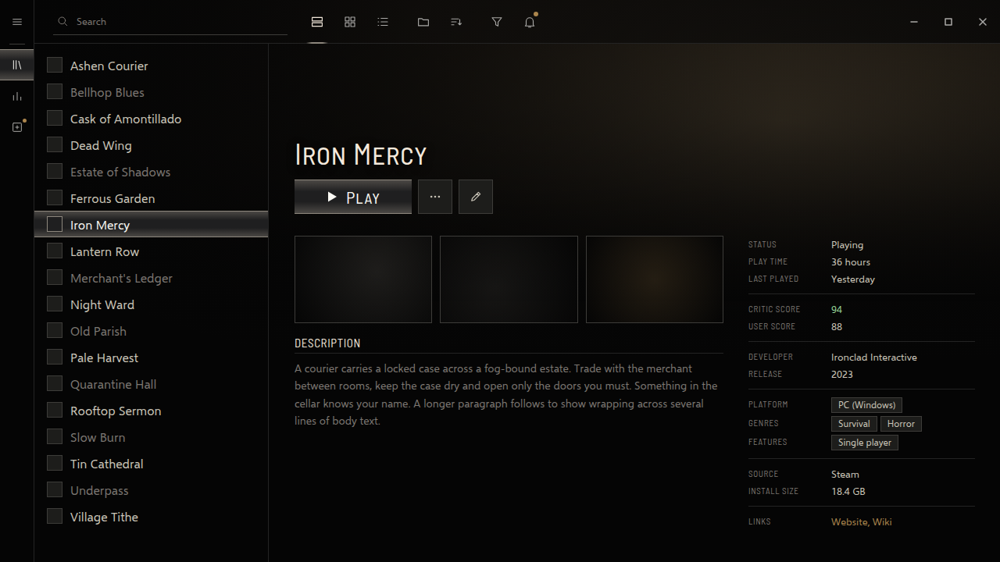
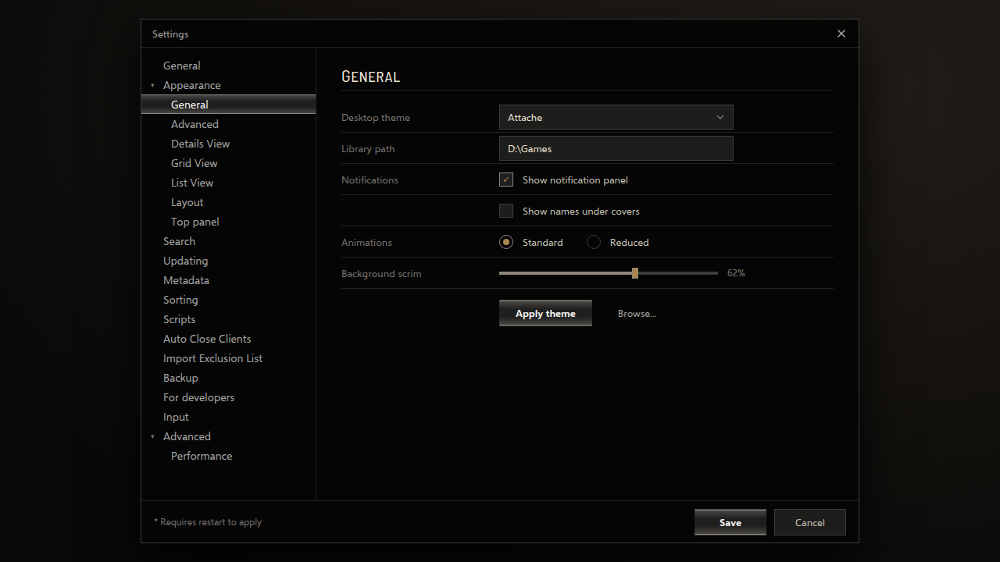

<!-- Generated by scripts/generate-readmes.mjs from info/*.yaml and git tags. Edit those, then re-run it; do not edit this file by hand. -->

# Attache

**A dark, minimal theme with a main menu of words, a brushed pewter selection plate and warm grey type. Inspired by the Resident Evil 4 menus.**

**[Download Attache 1.0.0](https://github.com/danitesler/playnite-extensions/releases/tag/attache-v1.0.0)**

## Screenshots

## About

After the Resident Evil 4 (2023) menus: the sidebar is the main menu, a column of uppercase words where the current one grows and steps out to the left; lists, menus and settings tabs use the options screen's brushed pewter selection plate; warm greys on near black, with the menus' amber "new" dot as the only accent. Colors were measured from screenshots of the game's menus.

Unofficial; not affiliated with Capcom. Resident Evil is a trademark of Capcom Co., Ltd. No game assets included.

## Install

1. **Inside Playnite:** open **Add-ons** from the main menu, browse or search for **Attache**, and install it from there.
2. **Or from GitHub:** download the `.pthm` file from the release page (see Download above) and open it in **Windows** (double-click it or drag it onto Playnite).
3. Click **Install** when Playnite prompts you, then restart Playnite.
4. Pick the theme in **Settings → Appearance → General → Theme** (Desktop mode), then restart Playnite if it asks.

## Details

- **Type:** Theme (Desktop mode)
- **Latest release:** [1.0.0](https://github.com/danitesler/playnite-extensions/releases/tag/attache-v1.0.0)
- **Playnite theme API:** 2.9.0
- **Tags:** Dark, Desktop, Gaming
- **Source:** [src/themes/Attache](https://github.com/danitesler/playnite-extensions/tree/main/src/themes/Attache)
- **Issues and suggestions:** [GitHub issues](https://github.com/danitesler/playnite-extensions/issues)

## Notices and licenses

- [LICENSE-Playnite.txt](info/LICENSE-Playnite.txt)
- [LICENSE-phosphor.txt](info/LICENSE-phosphor.txt)
- [NOTICE-Attache.txt](info/NOTICE-Attache.txt)

---

[← All add-ons](../../../README.md)
