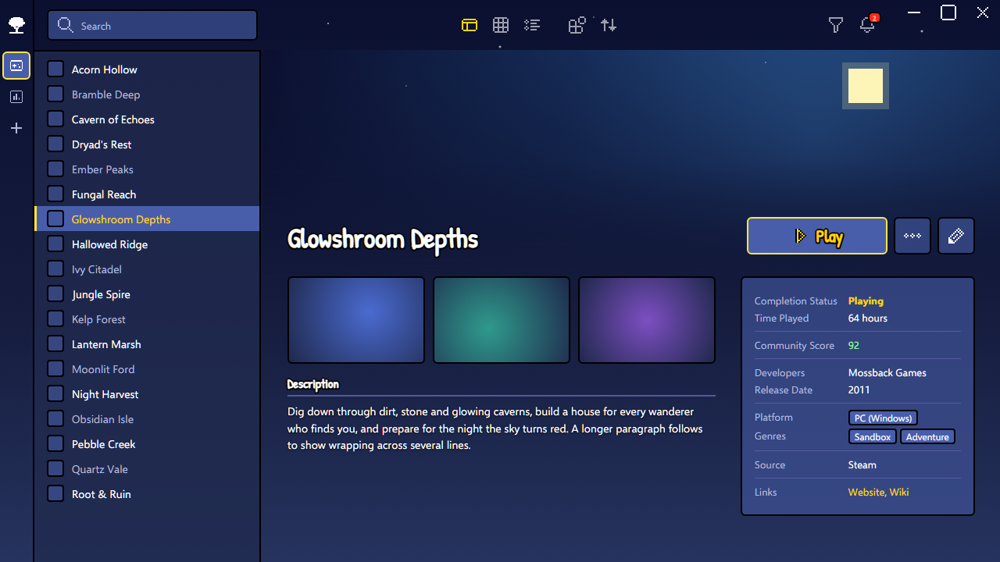
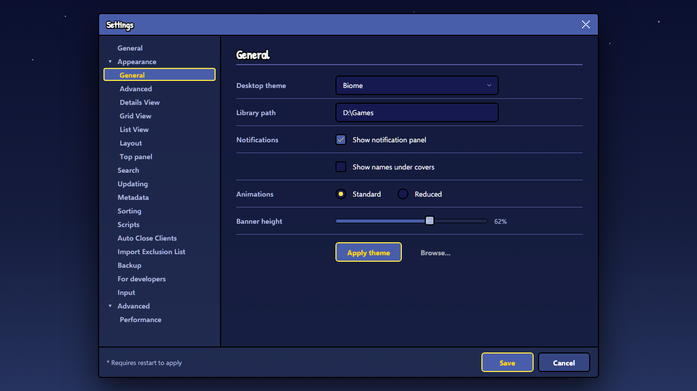

<!-- Generated by scripts/generate-readmes.mjs from info/*.yaml and git tags. Edit those, then re-run it; do not edit this file by hand. -->

# Biome

**A dark, minimal theme with blue menu panels over a night sky, outlined menu words that turn gold and pixel-art icons. Inspired by the Terraria main menu.**

_Not released yet._

## Screenshots

## About

After the Terraria main menu: translucent blue panels with black edges over a night sky, view switches as outlined menu words that turn gold, gold-edged hover states, inventory-slot covers and pixel-art icons. Values come from the game's interface code.

Unofficial; not affiliated with Re-Logic. Terraria is a trademark of Re-Logic. No game assets included.

## Install

1. **Inside Playnite:** open **Add-ons** from the main menu, browse or search for **Biome**, and install it from there.
2. **Or from GitHub:** download the `.pthm` file from the release page (see Download above) and open it in **Windows** (double-click it or drag it onto Playnite).
3. Click **Install** when Playnite prompts you, then restart Playnite.
4. Pick the theme in **Settings → Appearance → General → Theme** (Desktop mode), then restart Playnite if it asks.

## Details

- **Type:** Theme (Desktop mode)
- **Latest release:** not released yet
- **Playnite theme API:** 2.9.0
- **Tags:** Dark, Desktop, Gaming
- **Source:** [src/themes/Biome](https://github.com/danitesler/playnite-extensions/tree/main/src/themes/Biome)
- **Issues and suggestions:** [GitHub issues](https://github.com/danitesler/playnite-extensions/issues)

## Notices and licenses

- [LICENSE-Playnite.txt](info/LICENSE-Playnite.txt)
- [LICENSE-pixelarticons.txt](info/LICENSE-pixelarticons.txt)
- [NOTICE-Biome.txt](info/NOTICE-Biome.txt)

---

[← All add-ons](../../../README.md)
