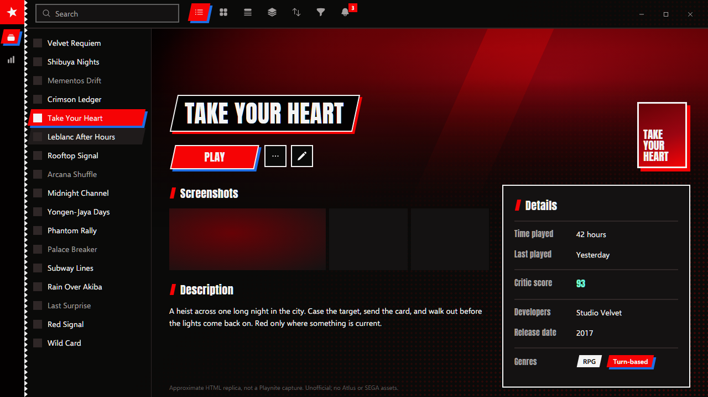
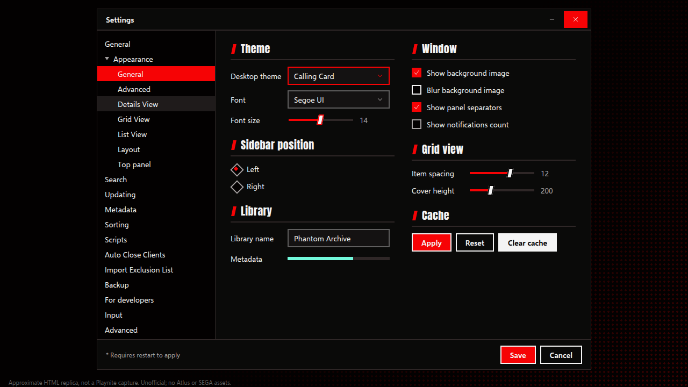

<!-- Generated by scripts/generate-readmes.mjs from info/*.yaml and git tags. Edit those, then re-run it; do not edit this file by hand. -->

# Calling Card

**A dark theme inspired by the Persona 5 menus: red, black and white, slanted plates with a blue sliver, heavy capitals.**

**[Download Calling Card 1.0.0](https://github.com/danitesler/playnite-extensions/releases/tag/callingcard-v1.0.0)**

## Screenshots

## About

Ink black pages, paper white text and one screaming red, inspired by the Persona 5 menus. Whatever is current sits on a slanted red plate with a blue sliver behind it; the game title is a battle name plate; tags are paper labels; a red halftone fades in at the corner. Unofficial fan theme: no ATLUS or SEGA assets, original artwork and Heroicons only. Headings use Impact, which ships with Windows.

## Install

1. **Inside Playnite:** open **Add-ons** from the main menu, browse or search for **Calling Card**, and install it from there.
2. **Or from GitHub:** download the `.pthm` file from the release page (see Download above) and open it in **Windows** (double-click it or drag it onto Playnite).
3. Click **Install** when Playnite prompts you, then restart Playnite.
4. Pick the theme in **Settings → Appearance → General → Theme** (Desktop mode), then restart Playnite if it asks.

## Details

- **Type:** Theme (Desktop mode)
- **Latest release:** [1.0.0](https://github.com/danitesler/playnite-extensions/releases/tag/callingcard-v1.0.0)
- **Playnite theme API:** 2.9.0
- **Tags:** Dark, Desktop
- **Source:** [src/themes/CallingCard](https://github.com/danitesler/playnite-extensions/tree/main/src/themes/CallingCard)
- **Issues and suggestions:** [GitHub issues](https://github.com/danitesler/playnite-extensions/issues)

## Notices and licenses

- [LICENSE-Playnite.txt](info/LICENSE-Playnite.txt)
- [LICENSE-heroicons.txt](info/LICENSE-heroicons.txt)
- [NOTICE-CallingCard.txt](info/NOTICE-CallingCard.txt)

---

[← All add-ons](../../../README.md)
