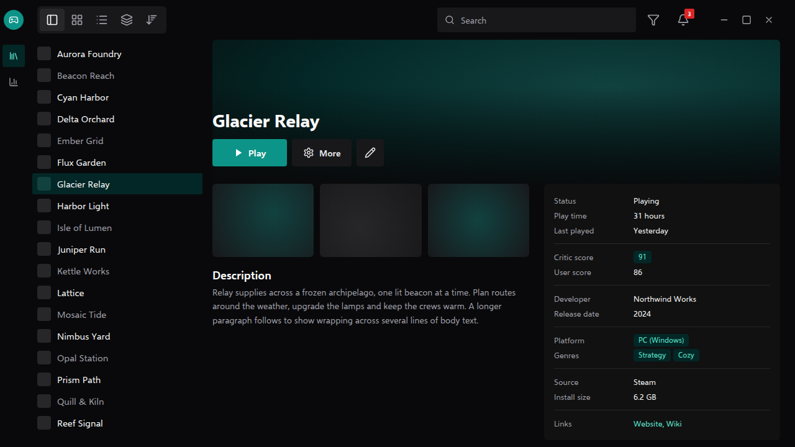
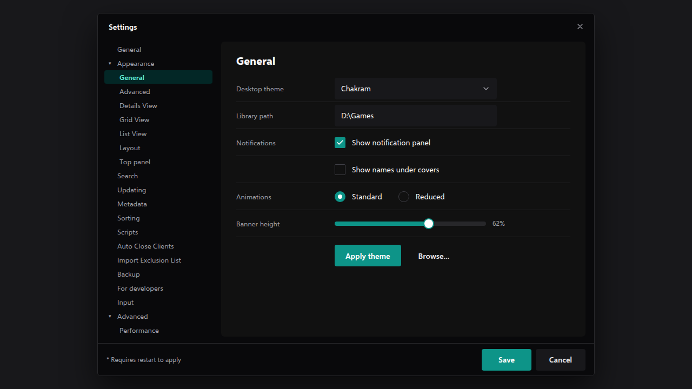

<!-- Generated by scripts/generate-readmes.mjs from info/*.yaml and git tags. Edit those, then re-run it; do not edit this file by hand. -->

# Chakra-inspired

**Unofficial fully dark desktop theme inspired by Chakra UI, in teal. Not affiliated with the Chakra UI project.**

**[Download Chakra-inspired 0.1.0](https://github.com/danitesler/playnite-extensions/releases/tag/chakraui-v0.1.0)**

## Screenshots

 

## About

An unofficial dark theme inspired by the look of Chakra UI, with a teal accent: one flat surface, segmented view controls and underline tabs.

Not affiliated with, endorsed by or sponsored by the Chakra UI project or Chakra Systems. Chakra UI is mentioned only to say what inspired the look.

## Install

1. **Inside Playnite:** open **Add-ons** from the main menu, browse or search for **Chakra-inspired**, and install it from there.
2. **Or from GitHub:** download the `.pthm` file from the release page (see Download above) and open it in **Windows** (double-click it or drag it onto Playnite).
3. Click **Install** when Playnite prompts you, then restart Playnite.
4. Pick the theme in **Settings → Appearance → General → Theme** (Desktop mode), then restart Playnite if it asks.

## Details

- **Type:** Theme (Desktop mode)
- **Latest release:** [0.1.0](https://github.com/danitesler/playnite-extensions/releases/tag/chakraui-v0.1.0)
- **Playnite theme API:** 2.9.0
- **Tags:** Dark, Minimal, Desktop, Teal
- **Inspired by (Chakra UI):** https://chakra-ui.com
- **Source:** [src/themes/ChakraUi](https://github.com/danitesler/playnite-extensions/tree/main/src/themes/ChakraUi)
- **Issues and suggestions:** [GitHub issues](https://github.com/danitesler/playnite-extensions/issues)

## Notices and licenses

- [LICENSE-Playnite.txt](info/LICENSE-Playnite.txt)
- [LICENSE-lucide.txt](info/LICENSE-lucide.txt)
- [NOTICE-ChakraUi.txt](info/NOTICE-ChakraUi.txt)

---

[← All add-ons](../../../README.md)
