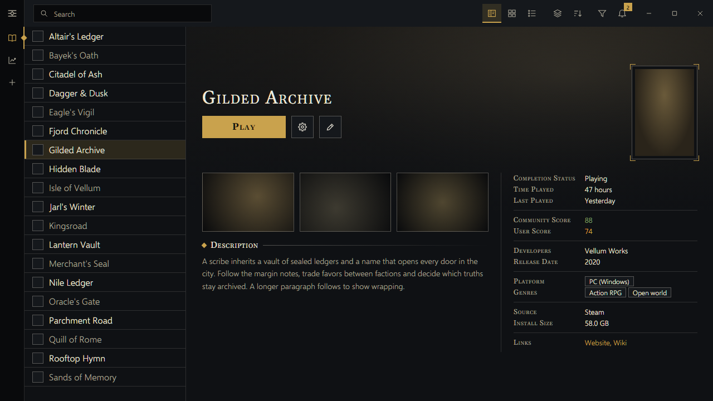
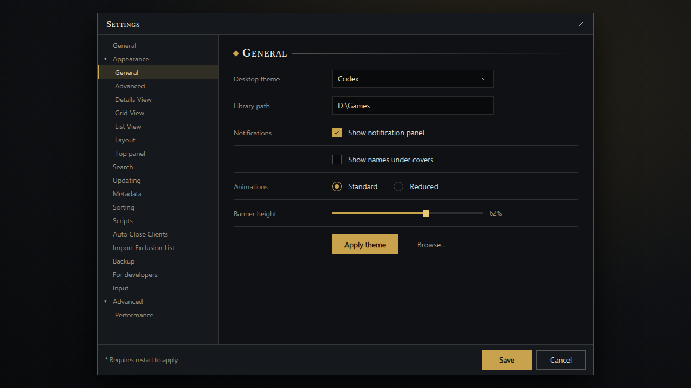

<!-- Generated by scripts/generate-readmes.mjs from info/*.yaml and git tags. Edit those, then re-run it; do not edit this file by hand. -->

# Codex

**A dark desktop theme in charcoal, ivory and gold, with a left icon rail and entry-style game screens. Inspired by the Assassin's Creed menus.**

**[Download Codex 0.1.0](https://github.com/danitesler/playnite-extensions/releases/tag/codex-v0.1.0)**

## Screenshots

 

## About

Charcoal, ivory and gold with a left icon rail, hairline rules, diamond markers and entry-style game screens, inspired by the Assassin's Creed menus.

Unofficial; not affiliated with Ubisoft. Assassin's Creed is a trademark of Ubisoft.

## Install

1. **Inside Playnite:** open **Add-ons** from the main menu, browse or search for **Codex**, and install it from there.
2. **Or from GitHub:** download the `.pthm` file from the release page (see Download above) and open it in **Windows** (double-click it or drag it onto Playnite).
3. Click **Install** when Playnite prompts you, then restart Playnite.
4. Pick the theme in **Settings → Appearance → General → Theme** (Desktop mode), then restart Playnite if it asks.

## Details

- **Type:** Theme (Desktop mode)
- **Latest release:** [0.1.0](https://github.com/danitesler/playnite-extensions/releases/tag/codex-v0.1.0)
- **Playnite theme API:** 2.9.0
- **Tags:** Dark, Desktop, Gold, Codex
- **Source:** [src/themes/Codex](https://github.com/danitesler/playnite-extensions/tree/main/src/themes/Codex)
- **Issues and suggestions:** [GitHub issues](https://github.com/danitesler/playnite-extensions/issues)

## Notices and licenses

- [LICENSE-Playnite.txt](info/LICENSE-Playnite.txt)
- [NOTICE-codex.txt](info/NOTICE-codex.txt)

---

[← All add-ons](../../../README.md)
