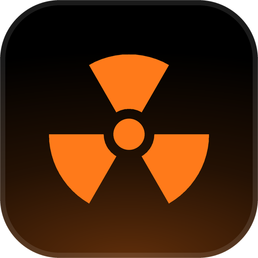
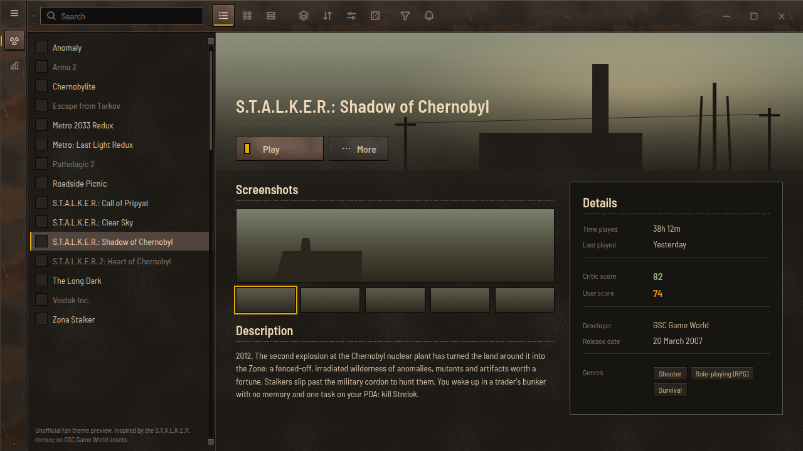
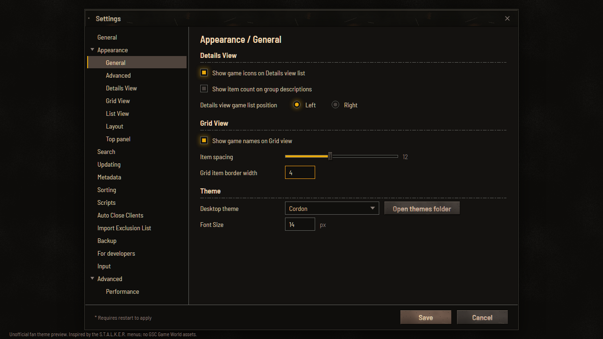

<!-- Generated by scripts/generate-readmes.mjs from info/*.yaml and git tags. Edit those, then re-run it; do not edit this file by hand. -->

# Cordon

**A dark theme inspired by the S.T.A.L.K.E.R. menus: rusted steel plates, olive-black panels, amber lamp toggles.**

_Not released yet._

## Screenshots

## About

Rusted, riveted steel plates for the rail, top bar, tabs and buttons, grainy olive-black panels, near-black value fields with a red-lens dropdown knob, amber lamp toggles and the beige and cream type of the S.T.A.L.K.E.R.: Shadow of Chernobyl Options screen. Unofficial fan theme: no GSC Game World assets, procedural textures and open icons only. Install Letterica and Graffiti for the closest type; otherwise it falls back to Bahnschrift SemiCondensed or Arial Narrow.

## Install

1. **Inside Playnite:** open **Add-ons** from the main menu, browse or search for **Cordon**, and install it from there.
2. **Or from GitHub:** download the `.pthm` file from the release page (see Download above) and open it in **Windows** (double-click it or drag it onto Playnite).
3. Click **Install** when Playnite prompts you, then restart Playnite.
4. Pick the theme in **Settings → Appearance → General → Theme** (Desktop mode), then restart Playnite if it asks.

## Details

- **Type:** Theme (Desktop mode)
- **Latest release:** not released yet
- **Playnite theme API:** 2.9.0
- **Tags:** Dark, Desktop
- **Source:** [src/themes/Cordon](https://github.com/danitesler/playnite-extensions/tree/main/src/themes/Cordon)
- **Issues and suggestions:** [GitHub issues](https://github.com/danitesler/playnite-extensions/issues)

## Notices and licenses

- [LICENSE-Playnite.txt](info/LICENSE-Playnite.txt)
- [LICENSE-phosphor.txt](info/LICENSE-phosphor.txt)
- [NOTICE-Cordon.txt](info/NOTICE-Cordon.txt)

---

[← All add-ons](../../../README.md)
