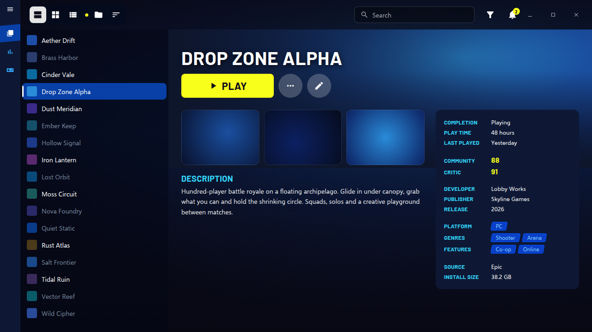
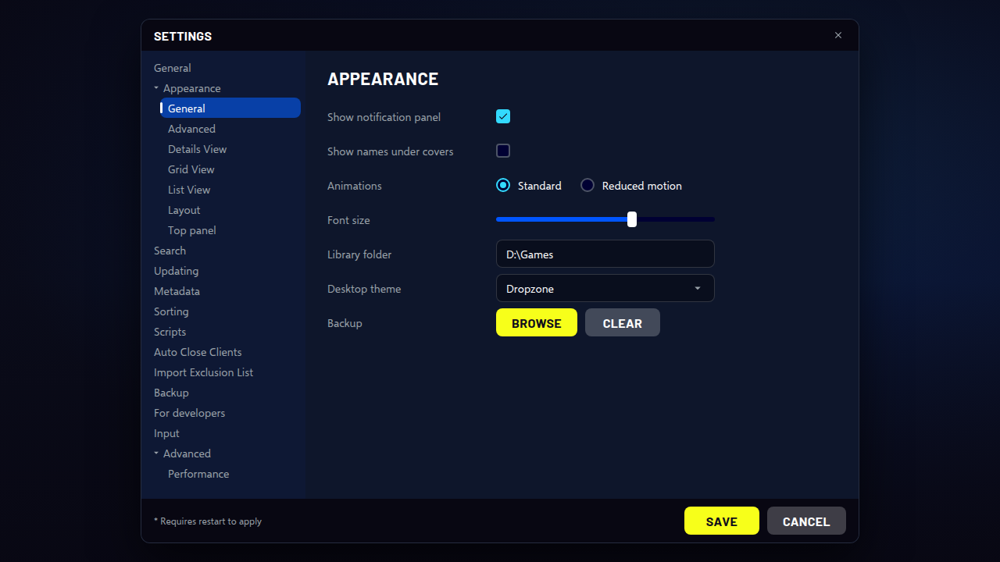

<!-- Generated by scripts/generate-readmes.mjs from info/*.yaml and git tags. Edit those, then re-run it; do not edit this file by hand. -->

# Dropzone

**A dark, minimal theme with a rounded navbar strip, a light pill for the current view, a yellow PLAY button and rounded covers. Inspired by the Fortnite lobby.**

**[Download Dropzone 1.0.0](https://github.com/danitesler/playnite-extensions/releases/tag/dropzone-v1.0.0)**

## Screenshots

## About

After the Fortnite lobby: deep navy surfaces, a rounded navbar strip with heavy capital view tabs and a light pill for the current one, a sidebar rail with a slanted blue current tab, a yellow PLAY button, rounded covers with a focus ring, and a game page laid out like an island's details screen.

Unofficial; not affiliated with Epic Games. Fortnite is a trademark of Epic Games, Inc. No game assets included.

## Install

1. **Inside Playnite:** open **Add-ons** from the main menu, browse or search for **Dropzone**, and install it from there.
2. **Or from GitHub:** download the `.pthm` file from the release page (see Download above) and open it in **Windows** (double-click it or drag it onto Playnite).
3. Click **Install** when Playnite prompts you, then restart Playnite.
4. Pick the theme in **Settings → Appearance → General → Theme** (Desktop mode), then restart Playnite if it asks.

## Details

- **Type:** Theme (Desktop mode)
- **Latest release:** [1.0.0](https://github.com/danitesler/playnite-extensions/releases/tag/dropzone-v1.0.0)
- **Playnite theme API:** 2.9.0
- **Tags:** Dark, Desktop, Gaming
- **Source:** [src/themes/Dropzone](https://github.com/danitesler/playnite-extensions/tree/main/src/themes/Dropzone)
- **Issues and suggestions:** [GitHub issues](https://github.com/danitesler/playnite-extensions/issues)

## Notices and licenses

- [LICENSE-Playnite.txt](info/LICENSE-Playnite.txt)
- [LICENSE-material-symbols.txt](info/LICENSE-material-symbols.txt)
- [NOTICE-Dropzone.txt](info/NOTICE-Dropzone.txt)

---

[← All add-ons](../../../README.md)
