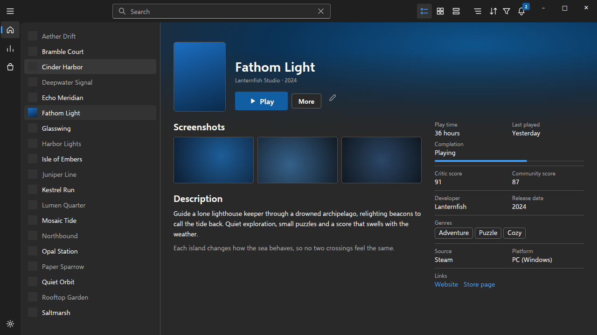
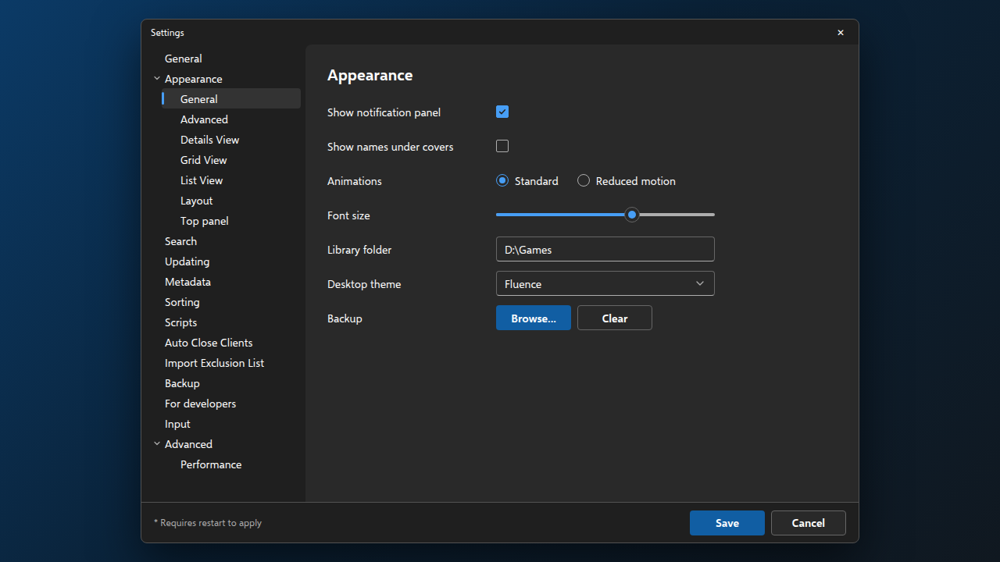

<!-- Generated by scripts/generate-readmes.mjs from info/*.yaml and git tags. Edit those, then re-run it; do not edit this file by hand. -->

# Fluence

**An unofficial dark desktop theme inspired by the Fluent 2 design system. Not affiliated with or endorsed by Microsoft.**

**[Download Fluence 0.1.0](https://github.com/danitesler/playnite-extensions/releases/tag/fluent2-v0.1.0)**

## Screenshots

## About

An unofficial dark desktop theme inspired by Microsoft's Fluent 2 design system, with a Windows 11 style navigation rail, centered search and underline inputs.

This theme is not affiliated with, endorsed by or sponsored by Microsoft Corporation. Fluent, Windows and Microsoft are trademarks of Microsoft; they are mentioned only to say what inspired the look. No Microsoft logos or fonts are included.

## Install

1. **Inside Playnite:** open **Add-ons** from the main menu, browse or search for **Fluence**, and install it from there.
2. **Or from GitHub:** download the `.pthm` file from the release page (see Download above) and open it in **Windows** (double-click it or drag it onto Playnite).
3. Click **Install** when Playnite prompts you, then restart Playnite.
4. Pick the theme in **Settings → Appearance → General → Theme** (Desktop mode), then restart Playnite if it asks.

## Details

- **Type:** Theme (Desktop mode)
- **Latest release:** [0.1.0](https://github.com/danitesler/playnite-extensions/releases/tag/fluent2-v0.1.0)
- **Playnite theme API:** 2.9.0
- **Tags:** Dark, Minimal, Desktop, Fluent
- **Inspiration (Microsoft Fluent 2 design system):** https://fluent2.microsoft.design
- **Source:** [src/themes/Fluent2](https://github.com/danitesler/playnite-extensions/tree/main/src/themes/Fluent2)
- **Issues and suggestions:** [GitHub issues](https://github.com/danitesler/playnite-extensions/issues)

## Notices and licenses

- [LICENSE-Playnite.txt](info/LICENSE-Playnite.txt)
- [LICENSE-fluentui-system-icons.txt](info/LICENSE-fluentui-system-icons.txt)
- [NOTICE-Fluent2.txt](info/NOTICE-Fluent2.txt)

---

[← All add-ons](../../../README.md)
