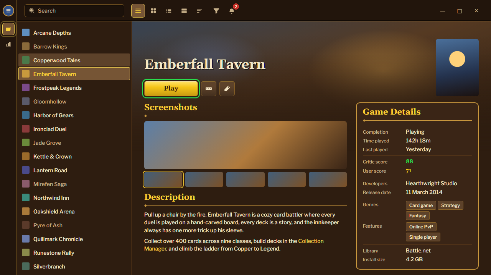
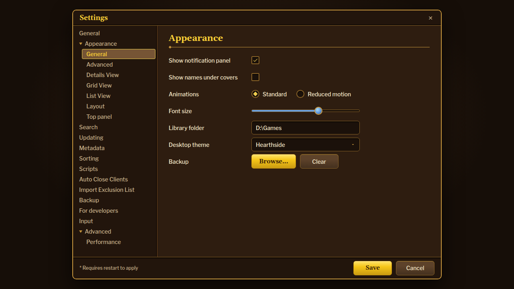

<!-- Generated by scripts/generate-readmes.mjs from info/*.yaml and git tags. Edit those, then re-run it; do not edit this file by hand. -->

# Hearthside

**A warm tavern theme inspired by the Hearthstone interface: dark wood, brass trim, gold selection, parchment tooltips and an End Turn Play button.**

**[Download Hearthside 1.0.0](https://github.com/danitesler/playnite-extensions/releases/tag/hearthside-v1.0.0)**

## Screenshots

## About

Dark tavern wood framed in brass, gold Belwe headings, lit plates with gold edges for whatever is current, parchment tooltips, mana-blue progress bars with a crystal slider thumb, and a yellow End Turn Play button that glows green, inspired by the Hearthstone interface. Unofficial fan theme: no Blizzard assets, original artwork only. Install Belwe for the closest headings; otherwise it falls back to Bookman Old Style or Georgia.

## Install

1. **Inside Playnite:** open **Add-ons** from the main menu, browse or search for **Hearthside**, and install it from there.
2. **Or from GitHub:** download the `.pthm` file from the release page (see Download above) and open it in **Windows** (double-click it or drag it onto Playnite).
3. Click **Install** when Playnite prompts you, then restart Playnite.
4. Pick the theme in **Settings → Appearance → General → Theme** (Desktop mode), then restart Playnite if it asks.

## Details

- **Type:** Theme (Desktop mode)
- **Latest release:** [1.0.0](https://github.com/danitesler/playnite-extensions/releases/tag/hearthside-v1.0.0)
- **Playnite theme API:** 2.9.0
- **Tags:** Dark, Desktop
- **Source:** [src/themes/Hearthside](https://github.com/danitesler/playnite-extensions/tree/main/src/themes/Hearthside)
- **Issues and suggestions:** [GitHub issues](https://github.com/danitesler/playnite-extensions/issues)

## Notices and licenses

- [LICENSE-Playnite.txt](info/LICENSE-Playnite.txt)
- [LICENSE-phosphor.txt](info/LICENSE-phosphor.txt)
- [NOTICE-Hearthside.txt](info/NOTICE-Hearthside.txt)

---

[← All add-ons](../../../README.md)
