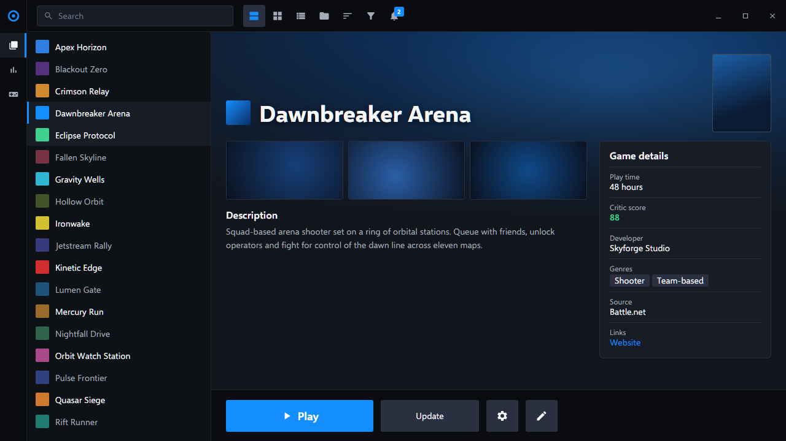
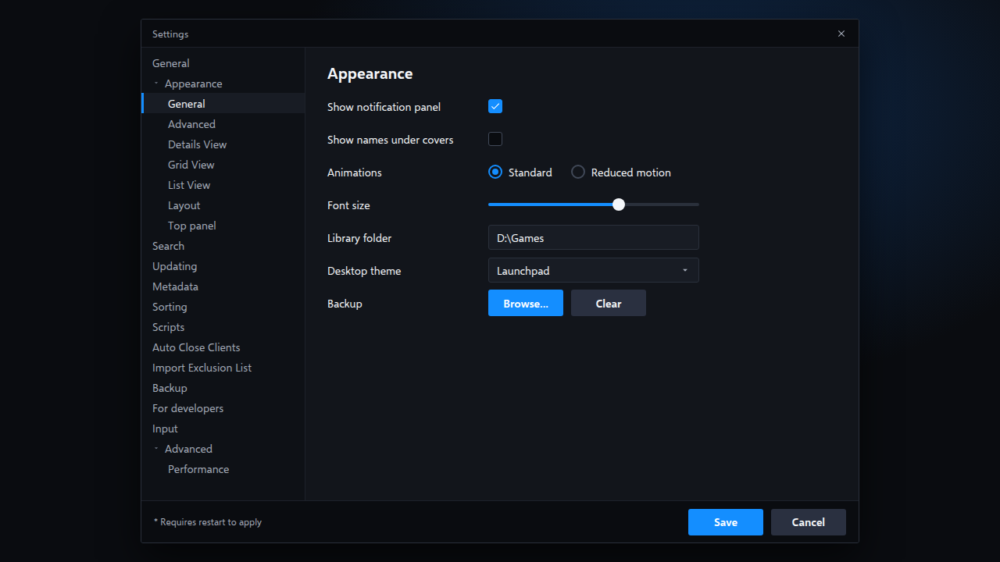

<!-- Generated by scripts/generate-readmes.mjs from info/*.yaml and git tags. Edit those, then re-run it; do not edit this file by hand. -->

# Launchpad

**A dark game-launcher theme with an icon rail, a game list, a full-width-art game page and a big blue Play button. Unofficial, inspired by the Battle.net app.**

**[Download Launchpad 0.1.0](https://github.com/danitesler/playnite-extensions/releases/tag/launchpad-v0.1.0)**

## Screenshots

 

## About

A game-launcher look inspired by the Battle.net app: an icon rail, a game list, a game page with full-width art and a big blue Play button. Colors are approximated.

Unofficial; not affiliated with, endorsed by or sponsored by Blizzard Entertainment. No Blizzard logos, icons, fonts or artwork are included. Battle.net is a trademark of Blizzard Entertainment.

## Install

1. **Inside Playnite:** open **Add-ons** from the main menu, browse or search for **Launchpad**, and install it from there.
2. **Or from GitHub:** download the `.pthm` file from the release page (see Download above) and open it in **Windows** (double-click it or drag it onto Playnite).
3. Click **Install** when Playnite prompts you, then restart Playnite.
4. Pick the theme in **Settings → Appearance → General → Theme** (Desktop mode), then restart Playnite if it asks.

## Details

- **Type:** Theme (Desktop mode)
- **Latest release:** [0.1.0](https://github.com/danitesler/playnite-extensions/releases/tag/launchpad-v0.1.0)
- **Playnite theme API:** 2.9.0
- **Tags:** Dark, Desktop, Launcher
- **Source:** [src/themes/Launchpad](https://github.com/danitesler/playnite-extensions/tree/main/src/themes/Launchpad)
- **Issues and suggestions:** [GitHub issues](https://github.com/danitesler/playnite-extensions/issues)

## Notices and licenses

- [LICENSE-Playnite.txt](info/LICENSE-Playnite.txt)
- [LICENSE-phosphor.txt](info/LICENSE-phosphor.txt)
- [NOTICE-Launchpad.txt](info/NOTICE-Launchpad.txt)

---

[← All add-ons](../../../README.md)
