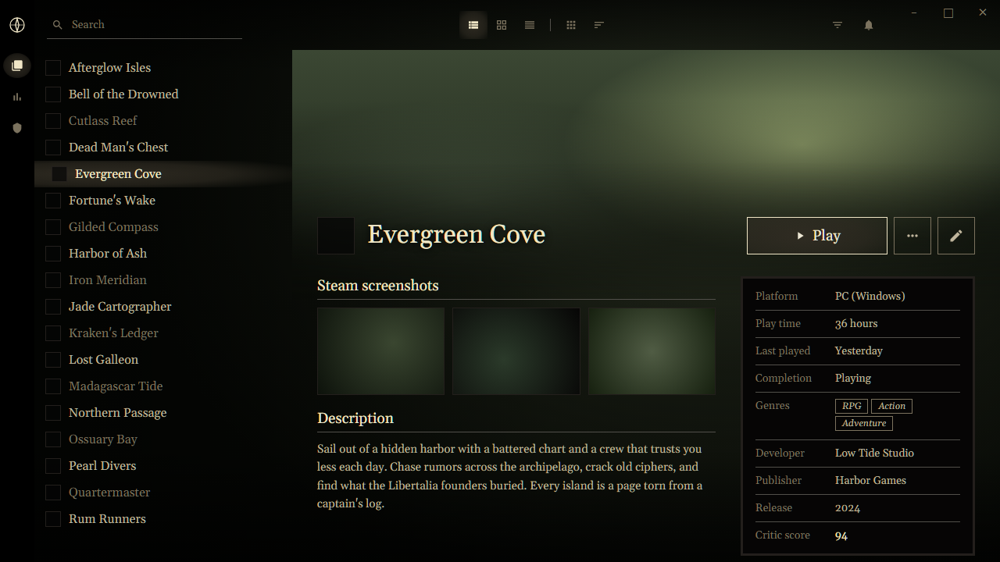
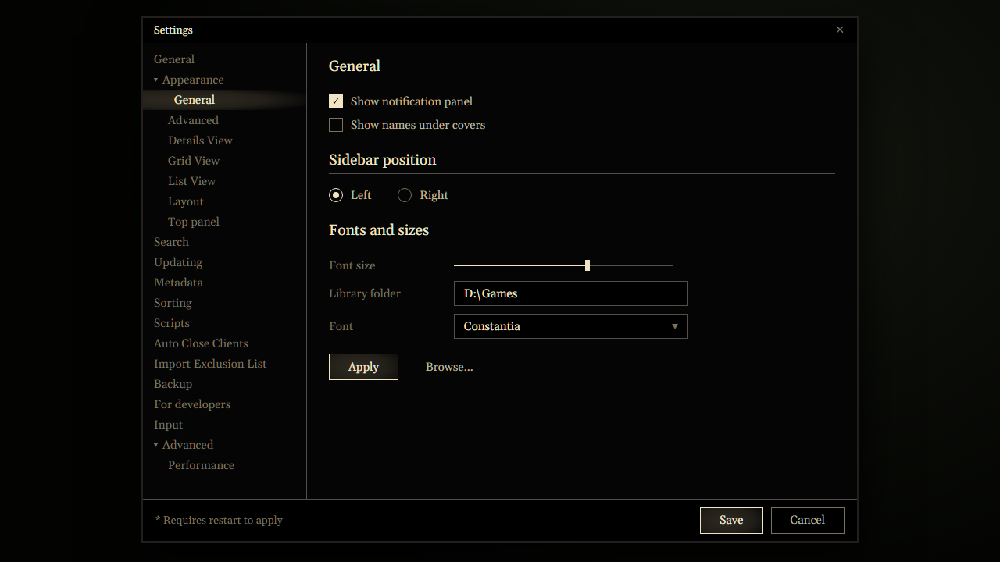

<!-- Generated by scripts/generate-readmes.mjs from info/*.yaml and git tags. Edit those, then re-run it; do not edit this file by hand. -->

# Libertalia

**Unofficial fan theme inspired by the Uncharted 4 menus: ivory text on black, a soft highlight behind the selected item, framed panels.**

_Not released yet._

## Screenshots

 

## About

After the Uncharted 4 menus: the library floats on the darkened game art like the main menu list over its scene. Muted khaki text at rest, warm ivory for the selected item on a feathered highlight that fades out to the right, title case serif type, hairline rules, framed near-black panels and square save-slot buttons. Colors were sampled from screenshots of the game's menus.

Unofficial fan theme; not affiliated with, endorsed by or sponsored by Naughty Dog or Sony Interactive Entertainment. Uncharted is a trademark of Sony Interactive Entertainment LLC, mentioned only to say what inspired the look. No Sony or Naughty Dog assets are included.

## Install

1. **Inside Playnite:** open **Add-ons** from the main menu, browse or search for **Libertalia**, and install it from there.
2. **Or from GitHub:** download the `.pthm` file from the release page (see Download above) and open it in **Windows** (double-click it or drag it onto Playnite).
3. Click **Install** when Playnite prompts you, then restart Playnite.
4. Pick the theme in **Settings → Appearance → General → Theme** (Desktop mode), then restart Playnite if it asks.

## Details

- **Type:** Theme (Desktop mode)
- **Latest release:** not released yet
- **Playnite theme API:** 2.9.0
- **Tags:** Dark, Desktop, Gaming
- **Source:** [src/themes/Libertalia](https://github.com/danitesler/playnite-extensions/tree/main/src/themes/Libertalia)
- **Issues and suggestions:** [GitHub issues](https://github.com/danitesler/playnite-extensions/issues)

## Notices and licenses

- [LICENSE-Playnite.txt](info/LICENSE-Playnite.txt)
- [LICENSE-material-symbols.txt](info/LICENSE-material-symbols.txt)
- [NOTICE-Libertalia.txt](info/NOTICE-Libertalia.txt)

---

[← All add-ons](../../../README.md)
