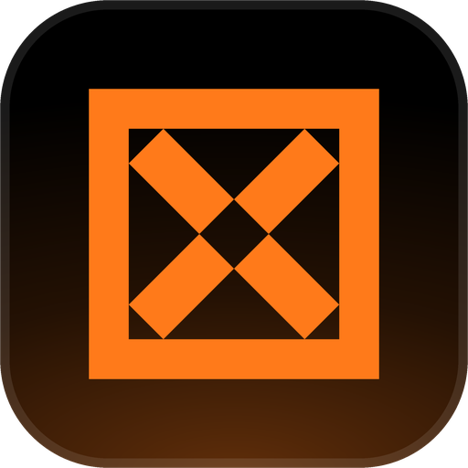
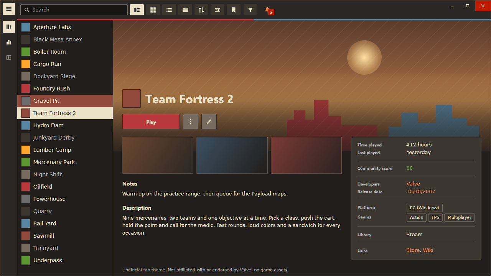
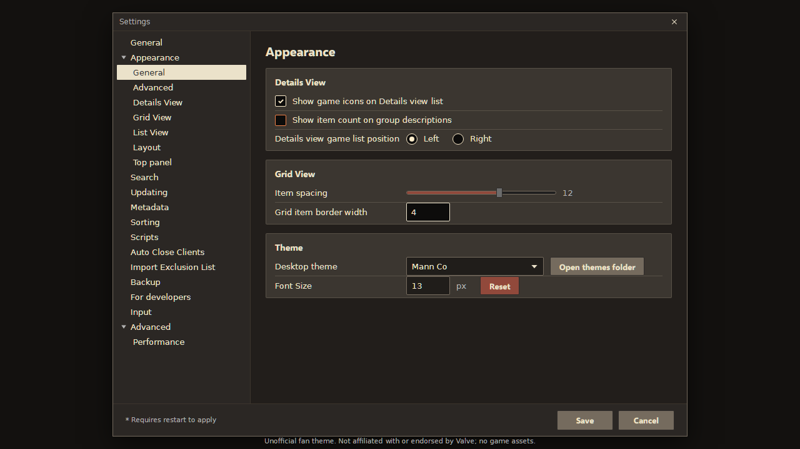

<!-- Generated by scripts/generate-readmes.mjs from info/*.yaml and git tags. Edit those, then re-run it; do not edit this file by hand. -->

# Mann Co

**A dark theme inspired by the Team Fortress 2 menus: tan paper buttons, rust hover, RED and BLU rule on the top bar.**

_Not released yet._

## Screenshots

## About

Dark brown pages, tan paper plates for whatever you press or select, rust on hover and a thin RED and BLU rule under the top bar, inspired by the Team Fortress 2 menus. Unofficial fan theme: no Valve assets, original artwork only. Uses Verdana and Trebuchet MS, Valve's own Windows fallbacks for its UI fonts.

## Install

1. **Inside Playnite:** open **Add-ons** from the main menu, browse or search for **Mann Co**, and install it from there.
2. **Or from GitHub:** download the `.pthm` file from the release page (see Download above) and open it in **Windows** (double-click it or drag it onto Playnite).
3. Click **Install** when Playnite prompts you, then restart Playnite.
4. Pick the theme in **Settings → Appearance → General → Theme** (Desktop mode), then restart Playnite if it asks.

## Details

- **Type:** Theme (Desktop mode)
- **Latest release:** not released yet
- **Playnite theme API:** 2.9.0
- **Tags:** Dark, Desktop
- **Source:** [src/themes/MannCo](https://github.com/danitesler/playnite-extensions/tree/main/src/themes/MannCo)
- **Issues and suggestions:** [GitHub issues](https://github.com/danitesler/playnite-extensions/issues)

## Notices and licenses

- [LICENSE-Playnite.txt](info/LICENSE-Playnite.txt)
- [NOTICE-MannCo.txt](info/NOTICE-MannCo.txt)

---

[← All add-ons](../../../README.md)
