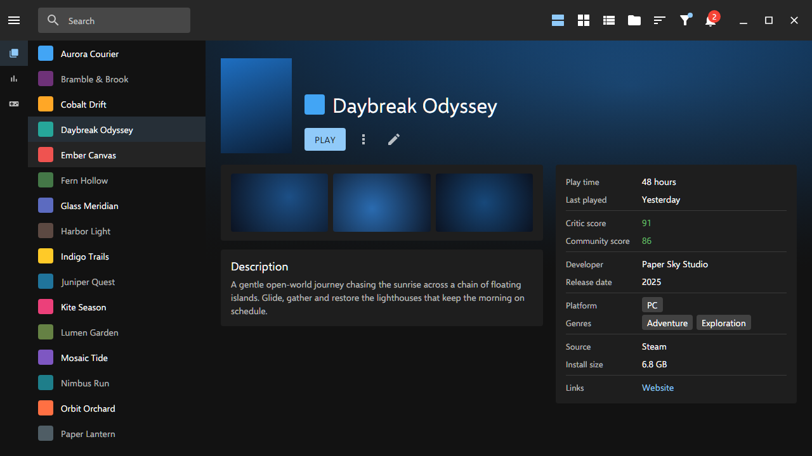
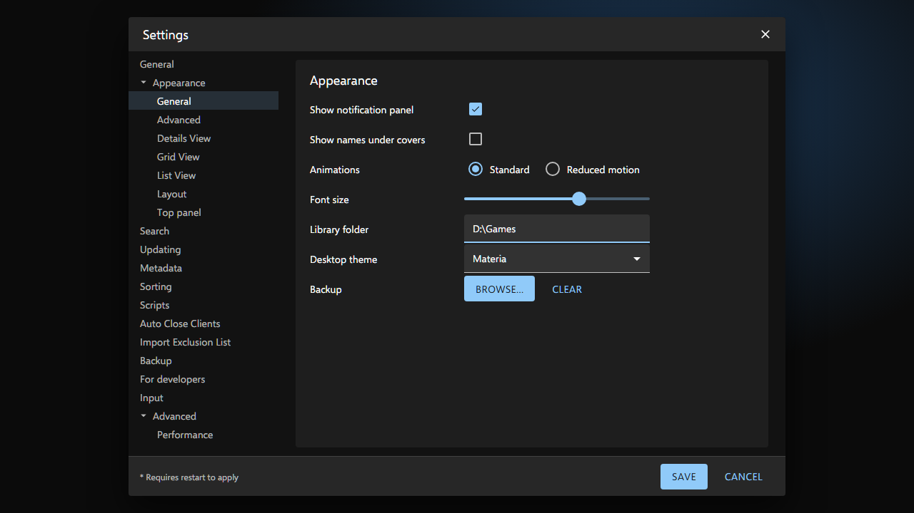

<!-- Generated by scripts/generate-readmes.mjs from info/*.yaml and git tags. Edit those, then re-run it; do not edit this file by hand. -->

# Materia

**A dark desktop theme inspired by Material Design and MUI's default dark theme. Unofficial; not affiliated with Google or MUI.**

**[Download Materia 1.0.0](https://github.com/danitesler/playnite-extensions/releases/tag/materia-v1.0.0)**

## Screenshots

## About

A look inspired by Material Design and the default dark theme of the MUI Material UI library: an elevated app bar, a mini drawer, filled inputs and uppercase buttons.

Unofficial; not affiliated with, endorsed by or sponsored by Google or MUI. Material Design is a trademark of Google LLC; MUI and Material UI are trademarks of Material UI SAS. They are mentioned only to say what inspired the look.

## Install

1. **Inside Playnite:** open **Add-ons** from the main menu, browse or search for **Materia**, and install it from there.
2. **Or from GitHub:** download the `.pthm` file from the release page (see Download above) and open it in **Windows** (double-click it or drag it onto Playnite).
3. Click **Install** when Playnite prompts you, then restart Playnite.
4. Pick the theme in **Settings → Appearance → General → Theme** (Desktop mode), then restart Playnite if it asks.

## Details

- **Type:** Theme (Desktop mode)
- **Latest release:** [1.0.0](https://github.com/danitesler/playnite-extensions/releases/tag/materia-v1.0.0)
- **Playnite theme API:** 2.9.0
- **Tags:** Dark, Desktop, Material
- **Inspired by (MUI Material UI):** https://mui.com
- **Source:** [src/themes/Materia](https://github.com/danitesler/playnite-extensions/tree/main/src/themes/Materia)
- **Issues and suggestions:** [GitHub issues](https://github.com/danitesler/playnite-extensions/issues)

## Notices and licenses

- [LICENSE-Playnite.txt](info/LICENSE-Playnite.txt)
- [LICENSE-material-icons.txt](info/LICENSE-material-icons.txt)
- [NOTICE-Materia.txt](info/NOTICE-Materia.txt)

---

[← All add-ons](../../../README.md)
