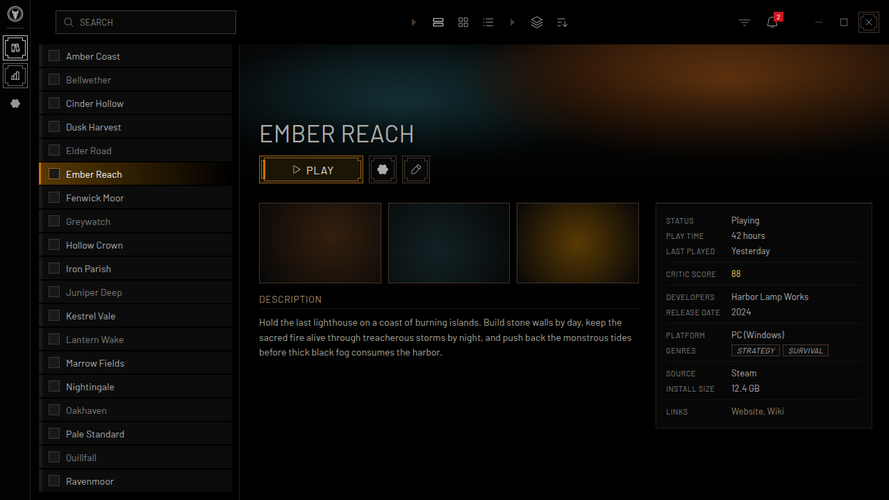
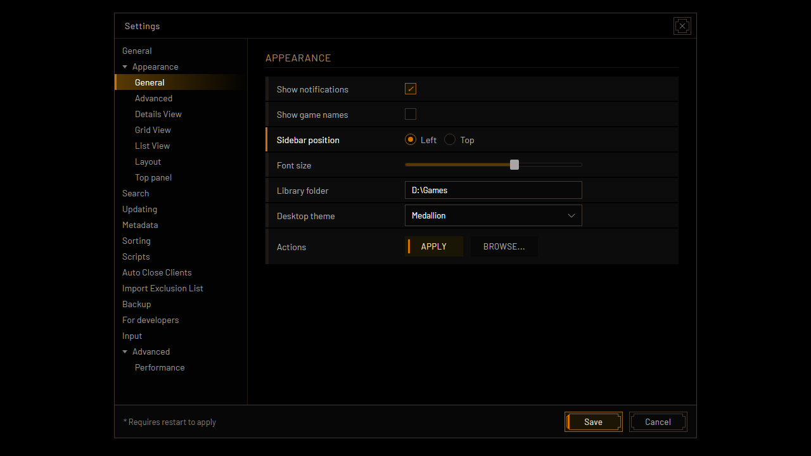

<!-- Generated by scripts/generate-readmes.mjs from info/*.yaml and git tags. Edit those, then re-run it; do not edit this file by hand. -->

# Medallion

**A black, minimal theme with a brush-edged icon rail, uppercase DIN text and thin double frames. Inspired by The Witcher 3 main menu.**

**[Download Medallion 1.0.0](https://github.com/danitesler/playnite-extensions/releases/tag/medallion-v1.0.0)**

## Screenshots

## About

After The Witcher 3: Wild Hunt main menu: a near-black icon rail with a rough brush edge on the left, uppercase DIN text, thin double frames with notched corners around the current item, brown hairlines and an amber wash on selected rows. Colors were sampled from the game's menus.

Unofficial; not affiliated with CD PROJEKT RED. The Witcher is a trademark of CD PROJEKT S.A. No game assets included.

## Install

1. **Inside Playnite:** open **Add-ons** from the main menu, browse or search for **Medallion**, and install it from there.
2. **Or from GitHub:** download the `.pthm` file from the release page (see Download above) and open it in **Windows** (double-click it or drag it onto Playnite).
3. Click **Install** when Playnite prompts you, then restart Playnite.
4. Pick the theme in **Settings → Appearance → General → Theme** (Desktop mode), then restart Playnite if it asks.

## Details

- **Type:** Theme (Desktop mode)
- **Latest release:** [1.0.0](https://github.com/danitesler/playnite-extensions/releases/tag/medallion-v1.0.0)
- **Playnite theme API:** 2.9.0
- **Tags:** Dark, Desktop, Gaming
- **Source:** [src/themes/Medallion](https://github.com/danitesler/playnite-extensions/tree/main/src/themes/Medallion)
- **Issues and suggestions:** [GitHub issues](https://github.com/danitesler/playnite-extensions/issues)

## Notices and licenses

- [LICENSE-Playnite.txt](info/LICENSE-Playnite.txt)
- [LICENSE-phosphor.txt](info/LICENSE-phosphor.txt)
- [NOTICE-Medallion.txt](info/NOTICE-Medallion.txt)

---

[← All add-ons](../../../README.md)
