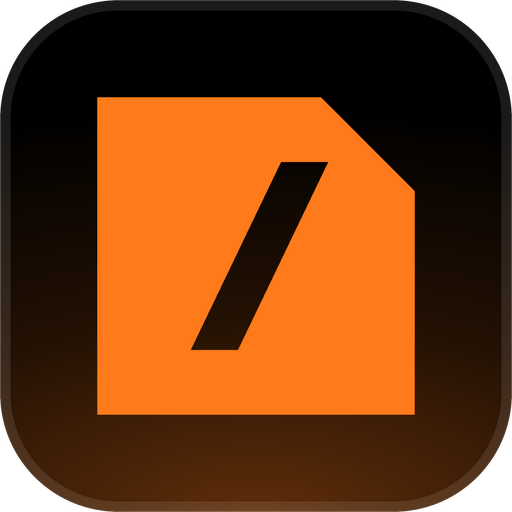
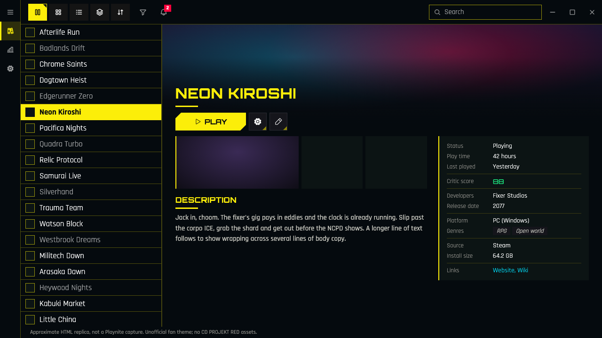
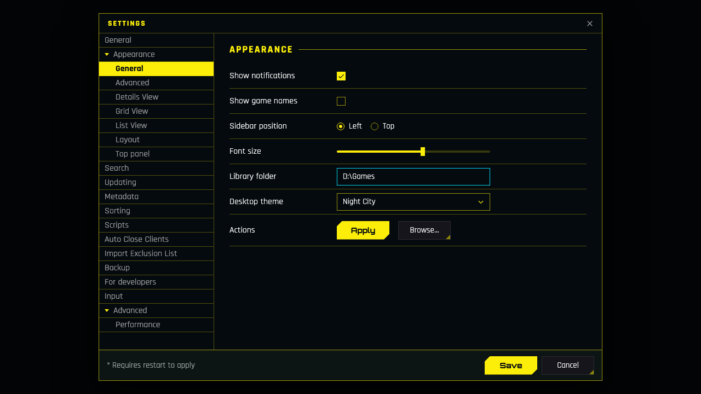

<!-- Generated by scripts/generate-readmes.mjs from info/*.yaml and git tags. Edit those, then re-run it; do not edit this file by hand. -->

# Night City 2

**An unofficial fan-made dark theme inspired by the yellow menus of Cyberpunk 2077. Not affiliated with CD PROJEKT RED.**

_Not released yet._

## Screenshots

## About

A fan-made dark theme inspired by the yellow menus of Cyberpunk 2077.

Unofficial; not affiliated with, endorsed by or sponsored by CD PROJEKT RED or CD PROJEKT S.A. Cyberpunk 2077 is a trademark of CD PROJEKT S.A. No game assets included.

## Install

1. **Inside Playnite:** open **Add-ons** from the main menu, browse or search for **Night City 2**, and install it from there.
2. **Or from GitHub:** download the `.pthm` file from the release page (see Download above) and open it in **Windows** (double-click it or drag it onto Playnite).
3. Click **Install** when Playnite prompts you, then restart Playnite.
4. Pick the theme in **Settings → Appearance → General → Theme** (Desktop mode), then restart Playnite if it asks.

## Details

- **Type:** Theme (Desktop mode)
- **Latest release:** not released yet
- **Playnite theme API:** 2.9.0
- **Tags:** Dark, Desktop
- **Source:** [src/themes/NightCity2](https://github.com/danitesler/playnite-extensions/tree/main/src/themes/NightCity2)
- **Issues and suggestions:** [GitHub issues](https://github.com/danitesler/playnite-extensions/issues)

## Notices and licenses

- [LICENSE-Playnite.txt](info/LICENSE-Playnite.txt)
- [LICENSE-phosphor.txt](info/LICENSE-phosphor.txt)
- [NOTICE-NightCity2.txt](info/NOTICE-NightCity2.txt)

---

[← All add-ons](../../../README.md)
