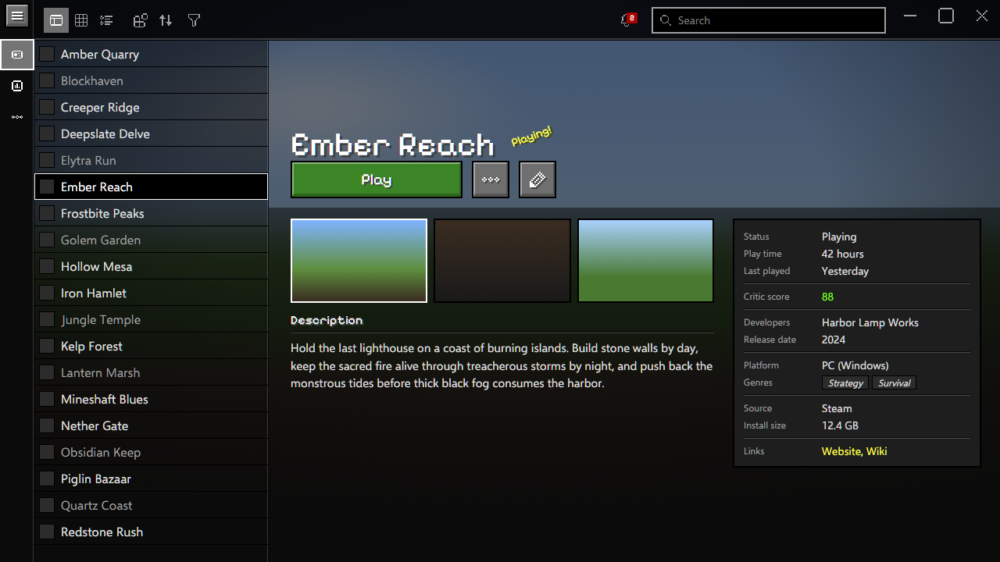
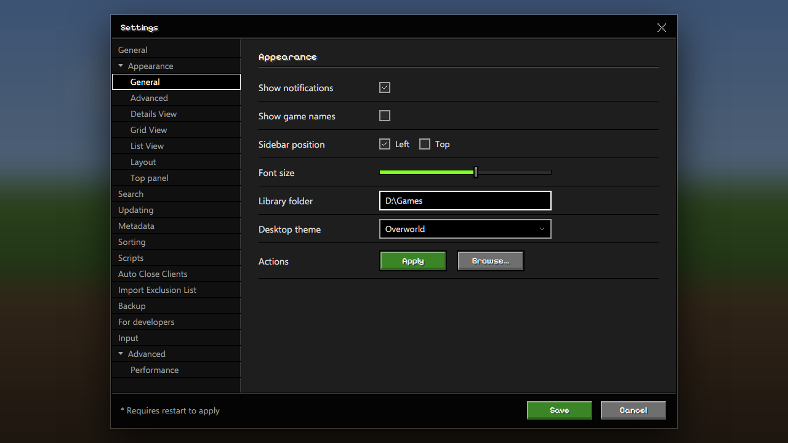

<!-- Generated by scripts/generate-readmes.mjs from info/*.yaml and git tags. Edit those, then re-run it; do not edit this file by hand. -->

# Overworld

**A dark desktop theme with stone buttons, a tab strip over blurred game art, pixel icons and a green Play button. Inspired by the Minecraft title screen.**

**[Download Overworld 1.0.0](https://github.com/danitesler/playnite-extensions/releases/tag/overworld-v1.0.0)**

## Screenshots

## About

A dark theme after the Minecraft Java Edition title screen and menus: stone buttons with a white outline on hover, black text fields, a dark tab strip over the blurred game art, white-outlined list selection, purple-edged tooltips, pixel icons, a yellow splash text and Bedrock's green Play button. Install Monocraft (free, OFL) for the pixel font.

Unofficial; not affiliated with Mojang Studios or Microsoft. Minecraft is a trademark of Mojang Synergies AB.

## Install

1. **Inside Playnite:** open **Add-ons** from the main menu, browse or search for **Overworld**, and install it from there.
2. **Or from GitHub:** download the `.pthm` file from the release page (see Download above) and open it in **Windows** (double-click it or drag it onto Playnite).
3. Click **Install** when Playnite prompts you, then restart Playnite.
4. Pick the theme in **Settings → Appearance → General → Theme** (Desktop mode), then restart Playnite if it asks.

## Details

- **Type:** Theme (Desktop mode)
- **Latest release:** [1.0.0](https://github.com/danitesler/playnite-extensions/releases/tag/overworld-v1.0.0)
- **Playnite theme API:** 2.9.0
- **Tags:** Dark, Desktop, Game, Green
- **Source:** [src/themes/Overworld](https://github.com/danitesler/playnite-extensions/tree/main/src/themes/Overworld)
- **Issues and suggestions:** [GitHub issues](https://github.com/danitesler/playnite-extensions/issues)

## Notices and licenses

- [LICENSE-Playnite.txt](info/LICENSE-Playnite.txt)
- [LICENSE-pixelarticons.txt](info/LICENSE-pixelarticons.txt)
- [NOTICE-Overworld.txt](info/NOTICE-Overworld.txt)

---

[← All add-ons](../../../README.md)
