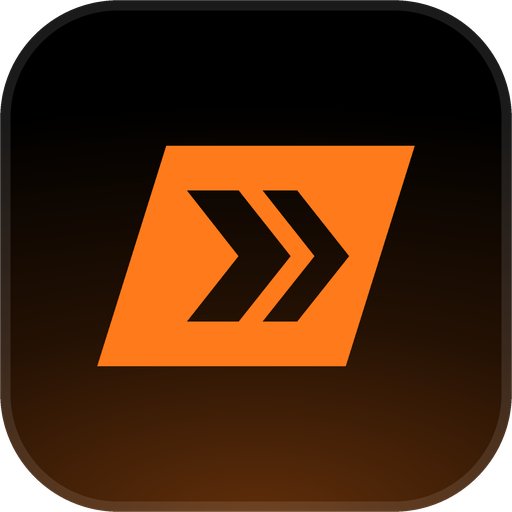

<!-- Generated by scripts/generate-readmes.mjs from info/*.yaml and git tags. Edit those, then re-run it; do not edit this file by hand. -->

# Payload

**A dark theme inspired by the Overwatch 2 menus: navy panels, cyan selection, slanted orange Play plate, team-colored scores.**

_Not released yet._

## About

Navy panels from the career profile, the game's cyan selection with black type, an OW2-orange Play button slanted 15 degrees like the VS plates, oblique display headings and scores in the team colors, inspired by the Overwatch 2 menus. Unofficial fan theme: no Blizzard assets, original artwork only. Install BigNoodleTooOblique (and Config) for the closest type; otherwise it falls back to Bahnschrift.

## Install

1. **Inside Playnite:** open **Add-ons** from the main menu, browse or search for **Payload**, and install it from there.
2. **Or from GitHub:** download the `.pthm` file from the release page (see Download above) and open it in **Windows** (double-click it or drag it onto Playnite).
3. Click **Install** when Playnite prompts you, then restart Playnite.
4. Pick the theme in **Settings → Appearance → General → Theme** (Desktop mode), then restart Playnite if it asks.

## Details

- **Type:** Theme (Desktop mode)
- **Latest release:** not released yet
- **Playnite theme API:** 2.9.0
- **Tags:** Dark, Desktop
- **Source:** [src/themes/Payload](https://github.com/danitesler/playnite-extensions/tree/main/src/themes/Payload)
- **Issues and suggestions:** [GitHub issues](https://github.com/danitesler/playnite-extensions/issues)

## Notices and licenses

- [LICENSE-Playnite.txt](info/LICENSE-Playnite.txt)
- [LICENSE-material-symbols.txt](info/LICENSE-material-symbols.txt)
- [NOTICE-Payload.txt](info/NOTICE-Payload.txt)

---

[← All add-ons](../../../README.md)
