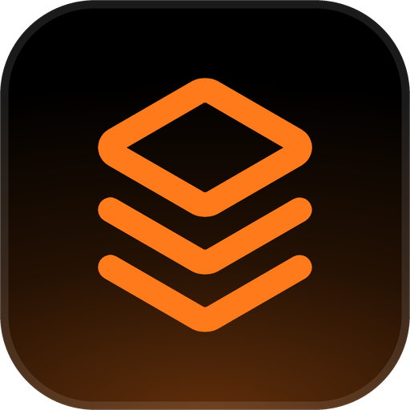
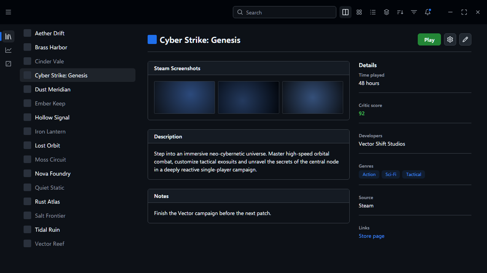
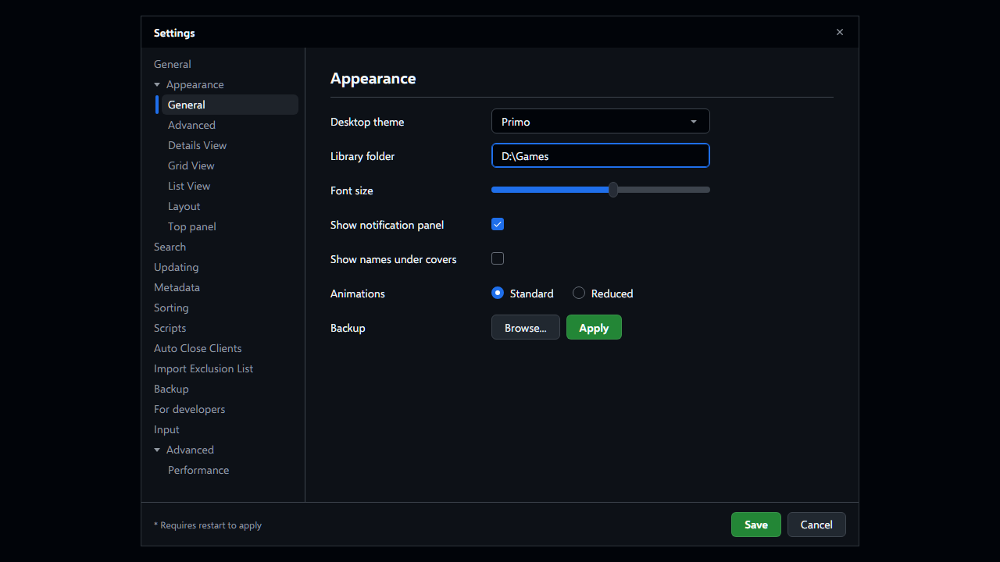

<!-- Generated by scripts/generate-readmes.mjs from info/*.yaml and git tags. Edit those, then re-run it; do not edit this file by hand. -->

# Primo

**An unofficial dark desktop theme inspired by GitHub's Primer design system. Not affiliated with GitHub.**

**[Download Primo 1.0.0](https://github.com/danitesler/playnite-extensions/releases/tag/primo-v1.0.0)**

## Screenshots

## About

An unofficial dark desktop theme inspired by GitHub's Primer design system, with a header band, a navigation rail, Octicons and green primary buttons.

This theme is not affiliated with, endorsed by or sponsored by GitHub, Inc. Primer and GitHub are trademarks of GitHub, Inc., mentioned only to say what inspired the look. No GitHub logos or artwork are included.

## Install

1. **Inside Playnite:** open **Add-ons** from the main menu, browse or search for **Primo**, and install it from there.
2. **Or from GitHub:** download the `.pthm` file from the release page (see Download above) and open it in **Windows** (double-click it or drag it onto Playnite).
3. Click **Install** when Playnite prompts you, then restart Playnite.
4. Pick the theme in **Settings → Appearance → General → Theme** (Desktop mode), then restart Playnite if it asks.

## Details

- **Type:** Theme (Desktop mode)
- **Latest release:** [1.0.0](https://github.com/danitesler/playnite-extensions/releases/tag/primo-v1.0.0)
- **Playnite theme API:** 2.9.0
- **Tags:** Dark, Minimal, Desktop
- **Inspired by (GitHub Primer):** https://primer.style
- **Source:** [src/themes/Primo](https://github.com/danitesler/playnite-extensions/tree/main/src/themes/Primo)
- **Issues and suggestions:** [GitHub issues](https://github.com/danitesler/playnite-extensions/issues)

## Notices and licenses

- [LICENSE-Playnite.txt](info/LICENSE-Playnite.txt)
- [LICENSE-octicons.txt](info/LICENSE-octicons.txt)
- [NOTICE-Primo.txt](info/NOTICE-Primo.txt)

---

[← All add-ons](../../../README.md)
