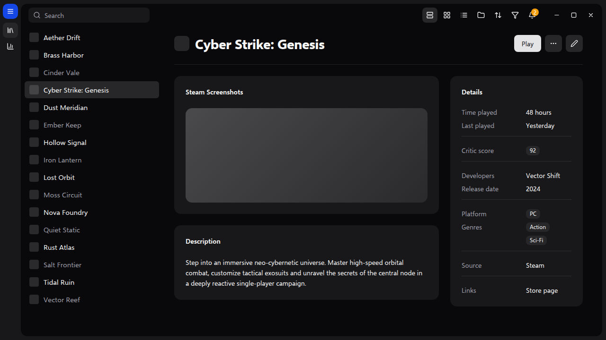
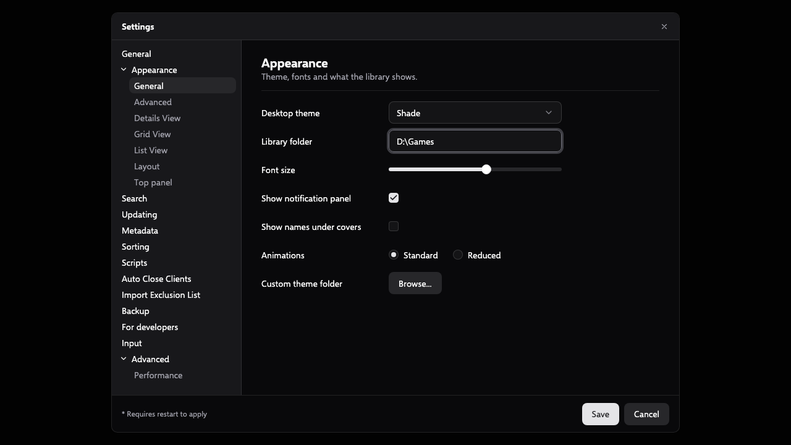

<!-- Generated by scripts/generate-readmes.mjs from info/*.yaml and git tags. Edit those, then re-run it; do not edit this file by hand. -->

# Shade

**An unofficial dark desktop theme inspired by shadcn/ui's zinc palette and components.**

**[Download Shade 1.0.0](https://github.com/danitesler/playnite-extensions/releases/tag/shade-v1.0.0)**

## Screenshots

## About

An unofficial, fully dark desktop theme inspired by shadcn/ui: a zinc palette, a rounded inset library card, borderless controls and Lucide icons.

Not affiliated with, endorsed by or sponsored by the shadcn/ui project or its owner.

## Install

1. **Inside Playnite:** open **Add-ons** from the main menu, browse or search for **Shade**, and install it from there.
2. **Or from GitHub:** download the `.pthm` file from the release page (see Download above) and open it in **Windows** (double-click it or drag it onto Playnite).
3. Click **Install** when Playnite prompts you, then restart Playnite.
4. Pick the theme in **Settings → Appearance → General → Theme** (Desktop mode), then restart Playnite if it asks.

## Details

- **Type:** Theme (Desktop mode)
- **Latest release:** [1.0.0](https://github.com/danitesler/playnite-extensions/releases/tag/shade-v1.0.0)
- **Playnite theme API:** 2.9.0
- **Tags:** Dark, Minimal, Desktop
- **Inspired by (shadcn/ui):** https://ui.shadcn.com
- **Source:** [src/themes/Shade](https://github.com/danitesler/playnite-extensions/tree/main/src/themes/Shade)
- **Issues and suggestions:** [GitHub issues](https://github.com/danitesler/playnite-extensions/issues)

## Notices and licenses

- [LICENSE-Playnite.txt](info/LICENSE-Playnite.txt)
- [LICENSE-lucide.txt](info/LICENSE-lucide.txt)
- [NOTICE-Shade.txt](info/NOTICE-Shade.txt)

---

[← All add-ons](../../../README.md)
