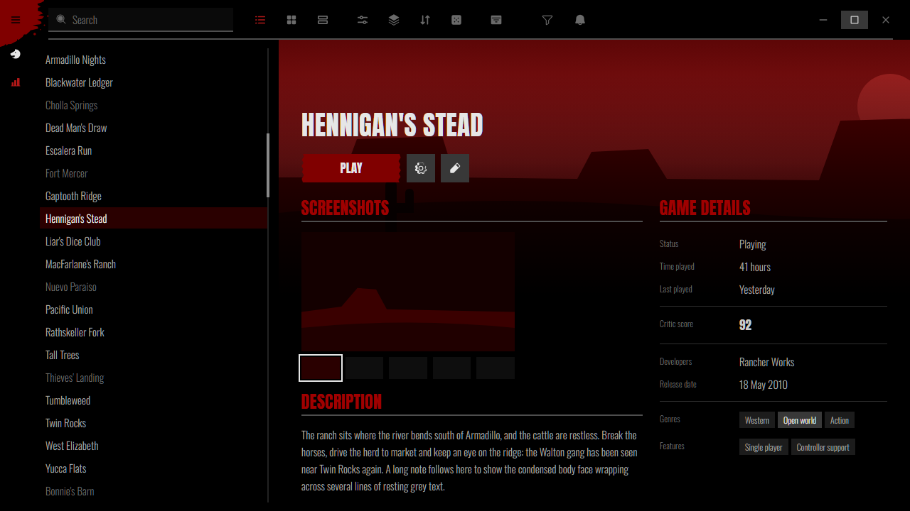
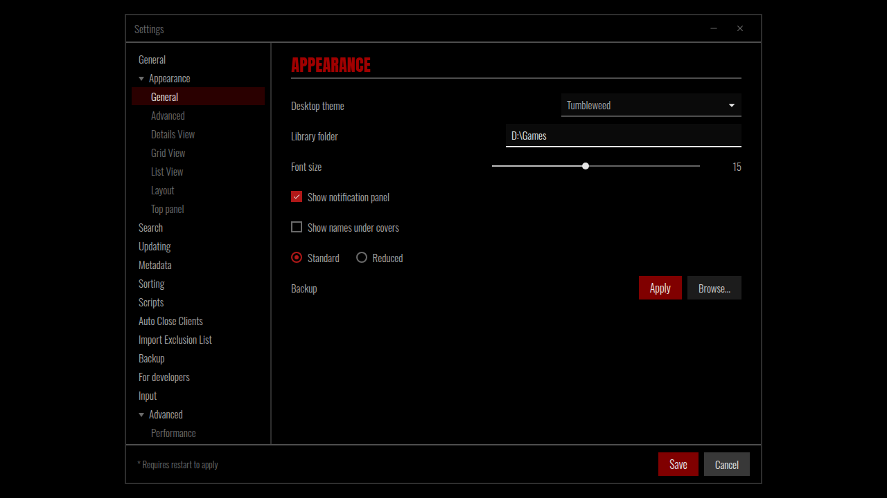

<!-- Generated by scripts/generate-readmes.mjs from info/*.yaml and git tags. Edit those, then re-run it; do not edit this file by hand. -->

# Tumbleweed

**A dark Western theme inspired by the Red Dead Redemption menus: maroon headings, white-on-select grey text, red duotone art.**

**[Download Tumbleweed 1.0.0](https://github.com/danitesler/playnite-extensions/releases/tag/tumbleweed-v1.0.0)**

## Screenshots

## About

Pure black pages, maroon headings over flat grey rules, grey text that turns white when selected, prompt-keycap buttons and game art washed in a red duotone, inspired by the original Red Dead Redemption menus. Unofficial fan theme: no Rockstar assets, original artwork only. Install Chinese Rocks (and Oswald) for the closest type; otherwise it falls back to Anton or Impact.

## Install

1. **Inside Playnite:** open **Add-ons** from the main menu, browse or search for **Tumbleweed**, and install it from there.
2. **Or from GitHub:** download the `.pthm` file from the release page (see Download above) and open it in **Windows** (double-click it or drag it onto Playnite).
3. Click **Install** when Playnite prompts you, then restart Playnite.
4. Pick the theme in **Settings → Appearance → General → Theme** (Desktop mode), then restart Playnite if it asks.

## Details

- **Type:** Theme (Desktop mode)
- **Latest release:** [1.0.0](https://github.com/danitesler/playnite-extensions/releases/tag/tumbleweed-v1.0.0)
- **Playnite theme API:** 2.9.0
- **Tags:** Dark, Desktop
- **Source:** [src/themes/Tumbleweed](https://github.com/danitesler/playnite-extensions/tree/main/src/themes/Tumbleweed)
- **Issues and suggestions:** [GitHub issues](https://github.com/danitesler/playnite-extensions/issues)

## Notices and licenses

- [LICENSE-Playnite.txt](info/LICENSE-Playnite.txt)
- [LICENSE-phosphor.txt](info/LICENSE-phosphor.txt)
- [NOTICE-Tumbleweed.txt](info/NOTICE-Tumbleweed.txt)

---

[← All add-ons](../../../README.md)
